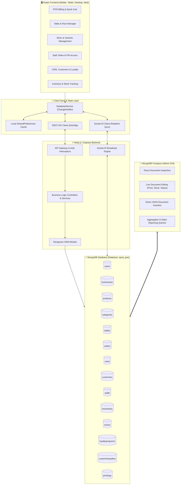

# 🍃 MongoDB Database System Design & MongoDB Compass Operations Guide

---

## 📌 1. Architecture Overview & Design Principles

Apna POS is engineered with an **Offline-First Multi-Tenant Hybrid Architecture**. The database layer is designed on **MongoDB (NoSQL Document Store)** using **Mongoose** Object Document Modeling (ODM), combined with **Flutter `DatabaseService`** on the client side for seamless offline caching and real-time backend synchronization.



---

## 🗂️ 2. Core Collections & Schema Design

All application data is segmented by `businessId` (which references `Business._id` or `User._id`), ensuring **strict multi-tenant isolation** and high query performance with compound indexing.

---

### 1️⃣ `users` Collection
Stores user authentication credentials, security PINs, profile data, subscription plans, and high-level role authorization.

#### 📄 Schema & Compass Sample Document:
```json
{
  "_id": { "$oid": "66f4a1000000000000000001" },
  "email": "owner@apnapos.com",
  "phone": "+919876543210",
  "passwordHash": "$2a$12$e8Y6bF0V7tqV9Yn5uL8v7.PZ1c7e9G6x2a4b8c0d2e4f6a8b0c2d4",
  "role": "owner",
  "status": "active",
  "isSuperAdmin": true,
  "emailVerified": true,
  "phoneVerified": true,
  "onboardingCompleted": true,
  "onboardingStep": 4,
  "subscription": {
    "plan": "pro",
    "status": "active",
    "billingCycle": "annual",
    "startDate": { "$date": "2026-01-01T00:00:00.000Z" },
    "expiresAt": { "$date": "2027-01-01T00:00:00.000Z" },
    "maxTables": 50,
    "maxStaff": 20,
    "notes": "Annual Pro License"
  },
  "businessId": { "$oid": "66f4a1000000000000000002" },
  "createdAt": { "$date": "2026-01-01T00:00:00.000Z" },
  "updatedAt": { "$date": "2026-10-06T00:00:00.000Z" }
}
```

---

### 2️⃣ `businesses` Collection
Defines restaurant properties, address with GeoJSON location, order preferences, tax rates (GST/Non-GST), payment modes, and UI view toggles.

#### 📄 Schema & Compass Sample Document:
```json
{
  "_id": { "$oid": "66f4a1000000000000000002" },
  "ownerId": { "$oid": "66f4a1000000000000000001" },
  "profile": {
    "name": "Apna Restaurant & Cafe",
    "companyName": "Apna Hospitality Pvt Ltd",
    "phone": "+919876543210",
    "website": "https://apnapos.com",
    "referralCode": "APNA100",
    "profileImage": ""
  },
  "business": {
    "country": "IN",
    "currency": "INR",
    "timezone": "Asia/Kolkata",
    "businessType": "Restaurant"
  },
  "address": {
    "addressLine": "Connaught Place, Inner Circle",
    "building": "Block B, Ground Floor",
    "landmark": "Near Rajiv Chowk Metro Gate 2",
    "city": "New Delhi",
    "state": "Delhi",
    "postalCode": "110001",
    "placeType": "work",
    "location": {
      "type": "Point",
      "coordinates": [77.2195, 28.6328]
    }
  },
  "orderSettings": {
    "services": {
      "dineIn": true,
      "takeaway": true,
      "delivery": true
    },
    "tax": {
      "type": "gst",
      "gstNumber": "07AAAAA0000A1Z5",
      "percentage": 5
    },
    "restaurantType": "both",
    "paymentMethods": {
      "cash": true,
      "upi": true,
      "card": true
    },
    "upiId": "apnapos@upi",
    "tableCount": 12,
    "posViewMode": "with_image",
    "enableChotuVoice": true
  },
  "createdAt": { "$date": "2026-01-01T00:00:00.000Z" },
  "updatedAt": { "$date": "2026-10-06T00:00:00.000Z" }
}
```

---

### 3️⃣ `products` Collection
Stores menu catalog items with rich multi-variant pricing, discount configurations, dietary types (`veg`, `non_veg`, `egg`, `beverage`), inventory tracking, stock levels, and voice search aliases for Chotu AI.

#### 📄 Schema & Compass Sample Document:
```json
{
  "_id": { "$oid": "66f4a1000000000000000010" },
  "businessId": { "$oid": "66f4a1000000000000000002" },
  "name": "Paneer Butter Masala",
  "category": "Main Course",
  "price": 280,
  "salePrice": 252,
  "hasDiscount": true,
  "discountPercent": 10,
  "foodType": "veg",
  "stock": 45,
  "trackInventory": true,
  "isAvailable": true,
  "sku": "PBM-001",
  "description": "Rich cottage cheese in creamy tomato-butter gravy",
  "image": "assets/images/menu/paneer_butter_masala.png",
  "images": ["assets/images/menu/paneer_butter_masala.png"],
  "aliases": ["paneer", "pbm", "butter paneer", "shahi paneer"],
  "variants": [
    {
      "name": "Half (300ml)",
      "price": 160,
      "hasDiscount": false,
      "discountPercent": 0,
      "salePrice": 160,
      "stock": 25
    },
    {
      "name": "Full (600ml)",
      "price": 280,
      "hasDiscount": true,
      "discountPercent": 10,
      "salePrice": 252,
      "stock": 20
    }
  ],
  "taxPercentage": 5,
  "createdAt": { "$date": "2026-01-01T00:00:00.000Z" },
  "updatedAt": { "$date": "2026-10-06T00:00:00.000Z" }
}
```

---

### 4️⃣ `categories` Collection
Defines category names, ordering index, icons, colors, and media thumbnails.

#### 📄 Schema & Compass Sample Document:
```json
{
  "_id": { "$oid": "66f4a1000000000000000020" },
  "businessId": { "$oid": "66f4a1000000000000000002" },
  "name": "Main Course",
  "icon": "restaurant_menu",
  "color": "#EF4444",
  "sortOrder": 2,
  "createdAt": { "$date": "2026-01-01T00:00:00.000Z" },
  "updatedAt": { "$date": "2026-10-06T00:00:00.000Z" }
}
```

---

### 5️⃣ `tables` Collection
Manages physical floor layout, seating capacity, table numbers, real-time table statuses, and live order linking.

#### 📄 Schema & Compass Sample Document:
```json
{
  "_id": { "$oid": "66f4a1000000000000000030" },
  "businessId": { "$oid": "66f4a1000000000000000002" },
  "tableNumber": 2,
  "name": "T-2",
  "floor": "Ground Floor",
  "capacity": 4,
  "status": "occupied",
  "currentOrderNumber": "ORD-1002",
  "currentOrderTotal": 532,
  "activeItemCount": 3,
  "occupiedSince": { "$date": "2026-10-06T00:25:00.000Z" },
  "createdAt": { "$date": "2026-01-01T00:00:00.000Z" },
  "updatedAt": { "$date": "2026-10-06T00:25:00.000Z" }
}
```

---

### 6️⃣ `orders` Collection
Maintains the complete transaction lifecycle: dine-in, takeaway, delivery orders, item breakdowns, discounts, taxes (CGST/SGST/IGST), tips, payment modes, KOT statuses, and waiter/cashier attribution.

#### 📄 Schema & Compass Sample Document:
```json
{
  "_id": { "$oid": "66f4a1000000000000000040" },
  "businessId": { "$oid": "66f4a1000000000000000002" },
  "orderNumber": "ORD-1001",
  "orderType": "dineIn",
  "tableNumber": "2",
  "customerName": "Ananya Roy",
  "customerPhone": "9876543210",
  "status": "completed",
  "items": [
    {
      "productId": "66f4a1000000000000000010",
      "name": "Paneer Butter Masala (Full)",
      "price": 252,
      "quantity": 1,
      "foodType": "veg",
      "note": "Medium spicy"
    },
    {
      "name": "Butter Garlic Naan",
      "price": 60,
      "quantity": 2,
      "foodType": "veg",
      "note": ""
    },
    {
      "name": "Cold Coffee with Ice Cream",
      "price": 120,
      "quantity": 1,
      "foodType": "beverage",
      "note": ""
    }
  ],
  "subtotal": 492,
  "discountAmount": 0,
  "cgst": 12.3,
  "sgst": 12.3,
  "taxAmount": 24.6,
  "tipAmount": 0,
  "totalAmount": 517,
  "paymentMethod": "UPI",
  "paymentStatus": "paid",
  "kotStatus": "printed",
  "kotNumber": 101,
  "tokenNo": "42",
  "invoiceNumber": "INV-2026-1001",
  "isPaid": true,
  "isDineIn": true,
  "servedBy": "Amit Kumar (Waiter)",
  "cashierName": "Pooja Verma (Cashier)",
  "createdAt": { "$date": "2026-10-06T00:15:00.000Z" },
  "updatedAt": { "$date": "2026-10-06T00:30:00.000Z" }
}
```

---

### 7️⃣ `staffs` Collection
Manages staff profiles, security PINs, custom granular permissions, departments, shifts, salaries, and employment status.

#### 📄 Schema & Compass Sample Document:
```json
{
  "_id": { "$oid": "66f4a1000000000000000050" },
  "businessId": { "$oid": "66f4a1000000000000000002" },
  "name": "Pooja Verma",
  "employeeId": "EMP-002",
  "phone": "+919822233344",
  "email": "pooja.cashier@apnapos.com",
  "role": "Cashier",
  "status": "Active",
  "pin": "2222",
  "permissions": ["pos", "tables", "orders", "crm"],
  "department": "Billing & Front Desk",
  "shift": "Morning Shift (8 AM - 4 PM)",
  "salary": 22000,
  "joiningDate": { "$date": "2026-01-15T00:00:00.000Z" },
  "createdAt": { "$date": "2026-01-15T00:00:00.000Z" },
  "updatedAt": { "$date": "2026-10-06T00:00:00.000Z" }
}
```

---

### 8️⃣ `customers` Collection (CRM & Leads)
Tracks customer directory, lifetime order counts, total revenue contribution, CRM stages, followup dates, tags, and contact details.

#### 📄 Schema & Compass Sample Document:
```json
{
  "_id": { "$oid": "66f4a1000000000000000060" },
  "businessId": { "$oid": "66f4a1000000000000000002" },
  "name": "Ananya Roy",
  "phone": "9876543210",
  "email": "ananya.roy@gmail.com",
  "address": "B-14, Connaught Place, New Delhi",
  "totalOrders": 14,
  "totalSpent": 4860,
  "visitCount": 14,
  "stage": "Won",
  "status": "Active Customer",
  "customerType": "Regular Customer",
  "tags": ["VIP", "Regular", "Dine-In Lover"],
  "isStarred": true,
  "isLiked": true,
  "firstVisit": { "$date": "2026-02-10T00:00:00.000Z" },
  "lastVisit": { "$date": "2026-10-06T00:00:00.000Z" },
  "createdAt": { "$date": "2026-02-10T00:00:00.000Z" },
  "updatedAt": { "$date": "2026-10-06T00:00:00.000Z" }
}
```

---

### 9️⃣ `inventories` Collection
Tracks kitchen raw materials, packaging, inventory alerts, and cost accounting.

#### 📄 Schema & Compass Sample Document:
```json
{
  "_id": { "$oid": "66f4a1000000000000000070" },
  "businessId": { "$oid": "66f4a1000000000000000002" },
  "itemName": "Paneer (Fresh Cottage Cheese)",
  "category": "Dairy",
  "quantity": 24.5,
  "unit": "kg",
  "minThreshold": 5.0,
  "costPerUnit": 320,
  "supplier": "Amul Dairy Distributor",
  "createdAt": { "$date": "2026-01-01T00:00:00.000Z" },
  "updatedAt": { "$date": "2026-10-06T00:00:00.000Z" }
}
```

---

### 🔟 `extras` Collection
Defines promo coupons, flat/percentage discounts, custom charges, and modifier add-ons.

#### 📄 Schema & Compass Sample Document:
```json
{
  "_id": { "$oid": "66f4a1000000000000000080" },
  "businessId": { "$oid": "66f4a1000000000000000002" },
  "name": "Flat 10% Off on Food",
  "code": "FLAT10",
  "type": "discount",
  "discountType": "percent",
  "value": 10,
  "minOrderAmount": 499,
  "maxDiscount": 150,
  "isAvailable": true,
  "status": "active",
  "createdAt": { "$date": "2026-01-01T00:00:00.000Z" },
  "updatedAt": { "$date": "2026-10-06T00:00:00.000Z" }
}
```

---

## ⚡ 3. How Changes in MongoDB Compass Drive Frontend Activities

| Frontend Activity | MongoDB Collection | Fields to Edit in MongoDB Compass | Immediate Effect in App |
| :--- | :--- | :--- | :--- |
| **Change Product Price** | `products` | `price`, `salePrice`, `variants[i].price` | Next POS order and Menu list show updated price immediately. |
| **Apply Product Discount** | `products` | `hasDiscount: true`, `discountPercent: 15` | Product renders discount badge and strikethrough price. |
| **Out-of-Stock Toggle** | `products` | `isAvailable: false` or `stock: 0` | Product displays "Out of Stock" pill and is un-orderable. |
| **Change Table Status** | `tables` | `status`: `"free"` / `"occupied"` / `"runningKot"` | Floor plan color switches dynamically (Green / Red / Orange). |
| **Move Table / Floor** | `tables` | `floor`: `"Rooftop"`, `tableNumber`: `15` | Table moves to specified floor tab in Table Management. |
| **Update Staff PIN & Role** | `staffs` | `pin`: `"9999"`, `role`: `"Manager"` | Staff logs in with new PIN and gains Manager permissions. |
| **Grant Custom Permission** | `staffs` | `permissions`: `["pos", "menu", "inventory"]` | Navigation drawer displays unlocked modules for that staff member. |
| **Update Business GST %** | `businesses` | `orderSettings.tax.percentage`: `18` | Order calculations auto-apply 18% GST (9% CGST + 9% SGST). |
| **Change Restaurant UPI ID** | `businesses` | `orderSettings.upiId`: `"mycafe@icici"` | Dynamic UPI QR code on POS & receipt points to new VPA. |
| **Switch POS View Mode** | `businesses` | `orderSettings.posViewMode`: `"without_image"` | POS screen switches to ultra-compact text-only grid. |
| **Add New Promo Coupon** | `extras` | Insert `{ "code": "SUPER50", "value": 50 }` | Cashier can apply `"SUPER50"` coupon at checkout. |
| **Adjust Raw Stock Quantity** | `inventories` | `quantity`: `3.5`, `minThreshold`: `5.0` | Inventory screen flags low-stock warning banner. |
| **Promote CRM Lead to VIP** | `customers` | `tags`: `["VIP", "Regular"]`, `stage`: `"Won"` | CRM screen updates lead badge and starred status. |

---

## 🚀 4. How to Connect & Seed MongoDB with Compass

### Step 1: Connect MongoDB Compass
1. Launch **MongoDB Compass** on your computer.
2. In the **New Connection** box, enter the connection URI:
   ```
   mongodb://127.0.0.1:27017/apna_pos
   ```
   *(Or your remote MongoDB Atlas connection string `mongodb+srv://...`)*
3. Click **Connect**. You will see the database `apna_pos`.

### Step 2: Run Database Seeder (One-Click Setup)
In the project directory, execute:
```bash
cd backend
npm run seed
```
This automatically sets up all 10 core collections, indexes, and full restaurant data ready for instant POS operations!

### Step 3: Edit or Insert Documents
- Click on any collection (e.g., `products`).
- Click the **Edit Document (Pencil Icon)** on any card.
- Change any value (e.g. `price: 320`) and click **Update**.
- In the Apna POS Flutter app, refresh or sync to see the change immediately!

---

> [!TIP]
> **Zero Breaking Changes**: All MongoDB schemas have full bidirectional compatibility with the Flutter client's `toJson()` / `fromJson()` mapping and offline local cache.
