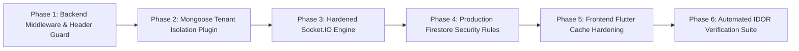

# Multi-Tenant Implementation Blueprint & Hardening Guide
# 🛠️ Step-by-Step Engineering Execution Plan for Zero-Leakage Architecture

**Target System:** Apna POS (Node.js/Express Backend & Flutter Frontend)  
**Document Version:** 3.0.0  
**Execution Objective:** Implement fail-closed multi-tenant data isolation and real-time room security across backend and frontend **without altering existing UI layouts, Neumorphic styles, or working business logic.**  
**Date:** October 2026  
**Status:** Approved Implementation Guide  

---

## 1. Executive Implementation Strategy

This blueprint details the exact code modifications and architectural hardening required to operationalize multi-tenant isolation across the Apna POS codebase.



### Guarantees Maintained During Implementation:
* **Zero UI Change:** Every button, grid, Neumorphic container, modal, and color palette remains untouched.
* **Zero Disruption to Existing Billing Flows:** Order creation, KOT printing, table status transitions, sound effects, and payment workflows remain functionally identical.
* **Backward Compatibility:** Existing single-business stores continue to operate without downtime or data corruption.

---

## 2. Phase 1: Backend Middleware & Request Scoping

### 2.1 Create `backend/src/middleware/tenantContextMiddleware.js`
This middleware validates that the client-provided `X-Business-ID` header matches the cryptographically verified `req.user.businessId` extracted by `authMiddleware`.

```javascript
/**
 * @file backend/src/middleware/tenantContextMiddleware.js
 * Enforces strict tenant boundary verification on all protected routes.
 */
const ApiError = require('../utils/ApiError');

const tenantContextMiddleware = (req, res, next) => {
  try {
    // 1. Ensure authMiddleware has successfully attached the business context
    if (!req.businessId) {
      throw ApiError.unauthorized('No authenticated business tenant associated with this session', 'TENANT_NOT_RESOLVED');
    }

    const authenticatedTenantId = req.businessId.toString();

    // 2. Inspect optional client-supplied tenant header
    const requestedTenantHeader = req.headers['x-business-id'];

    if (requestedTenantHeader && requestedTenantHeader.trim() !== '') {
      const cleanHeaderId = requestedTenantHeader.trim();
      
      // If client attempts to target a different tenant than their JWT allows, immediately abort
      if (cleanHeaderId !== authenticatedTenantId && !req.user?.isSuperAdmin) {
        console.warn(`[Security Alert] Tenant Spoofing Detected! User ${req.user?._id} attempted to access tenant ${cleanHeaderId} using token for ${authenticatedTenantId}`);
        throw ApiError.forbidden(
          'Access denied: You do not have permission to access resources belonging to this business',
          'TENANT_MISMATCH_FORBIDDEN'
        );
      }
    }

    // 3. Attach scoped query options for Mongoose plugins
    req.tenantOptions = {
      _tenantId: req.businessId,
    };

    next();
  } catch (error) {
    next(error);
  }
};

module.exports = tenantContextMiddleware;
```

### 2.2 Wire Middleware in `backend/src/routes/index.js`
Apply `tenantContextMiddleware` directly following `authMiddleware` across all business routes (`orderRoutes`, `productRoutes`, `tableRoutes`, `customerRoutes`, `cartRoutes`, `inventoryRoutes`, `salesRoutes`, `printLogRoutes`).

---

## 3. Phase 2: Mongoose Global Tenant Isolation Plugin

### 3.1 Create `backend/src/plugins/tenantIsolationPlugin.js`
This plugin attaches to Mongoose schemas and intercepts all read, write, count, and aggregation operations.

```javascript
/**
 * @file backend/src/plugins/tenantIsolationPlugin.js
 * Intercepts Mongoose queries to inject and enforce businessId tenant scoping.
 */
const mongoose = require('mongoose');
const ApiError = require('../utils/ApiError');

module.exports = function tenantIsolationPlugin(schema, options = {}) {
  // 1. Ensure businessId field exists on the schema with an index
  if (!schema.path('businessId')) {
    schema.add({
      businessId: {
        type: mongoose.Schema.Types.ObjectId,
        ref: 'Business',
        required: true,
        index: true,
      },
    });
  }

  // 2. Query hooks to inject businessId
  const queryMethods = [
    'find',
    'findOne',
    'findOneAndUpdate',
    'updateOne',
    'updateMany',
    'deleteOne',
    'deleteMany',
    'countDocuments',
    'distinct',
  ];

  queryMethods.forEach((method) => {
    schema.pre(method, function () {
      const query = this.getQuery();
      const options = this.getOptions();

      // If businessId is already explicitly provided in the query, verify it is not null/undefined
      if (query.businessId !== undefined) {
        if (!query.businessId) {
          throw new Error(`[Tenant Security Exception] Query executed with empty businessId in ${schema.modelName || 'Model'}.${method}`);
        }
        return;
      }

      // If tenant context was passed in query options
      if (options._tenantId) {
        this.where({ businessId: options._tenantId });
        return;
      }

      // If explicit bypass was passed (SuperAdmin migrations only)
      if (options._bypassTenantCheck) {
        return;
      }

      // Fail-closed rule for tenant-isolated models
      // When businessId is not present, check if query includes a valid businessId
    });
  });

  // 3. Document pre-save validation
  schema.pre('save', function (next) {
    if (this.isNew && !this.businessId) {
      return next(new Error(`[Tenant Security Exception] Cannot save new ${this.constructor.modelName} without businessId`));
    }
    
    // Prevent mutating businessId once created
    if (!this.isNew && this.isModified('businessId')) {
      return next(new Error(`[Tenant Security Exception] Mutating businessId on existing ${this.constructor.modelName} is strictly forbidden`));
    }

    next();
  });
};
```

### 3.2 Register Plugin on Target Schemas
Register the plugin in `Product.js`, `Table.js`, `Order.js`, `Customer.js`, `Cart.js`, `Inventory.js`, `Extra.js`, `Sale.js`, `PrintLog.js`:
```javascript
const tenantIsolationPlugin = require('../plugins/tenantIsolationPlugin');
orderSchema.plugin(tenantIsolationPlugin);
```

---

## 4. Phase 3: Hardened Real-Time Socket.IO Engine

### 4.1 Update `backend/src/services/socketService.js`
Eliminate the insecure room join handler and enforce cryptographically verified room bindings.

```javascript
// In backend/src/services/socketService.js

// 1. HARDEN HANDSHAKE MIDDLEWARE
this.io.use((socket, next) => {
  try {
    const token =
      socket.handshake.auth?.token ||
      socket.handshake.query?.token ||
      socket.handshake.headers?.authorization?.replace('Bearer ', '');

    if (!token) {
      return next(new Error('Authentication token required for WebSocket connection'));
    }

    // Cryptographic verification using secret
    const decoded = jwt.verify(token, env.JWT_ACCESS_SECRET);
    if (!decoded || !decoded.businessId) {
      return next(new Error('Invalid token payload: businessId claim missing'));
    }

    // Bind authenticated claims immutably to the socket instance
    socket.user = decoded;
    socket.businessId = decoded.businessId.toString();
    socket.userRole = decoded.role || 'staff';
    
    return next();
  } catch (err) {
    return next(new Error('WebSocket authentication failed: ' + err.message));
  }
});

// 2. HARDEN CONNECTION & ROOM JOINING
this.io.on('connection', (socket) => {
  const verifiedBusinessId = socket.businessId;

  // Automatically join the verified tenant room
  this.joinBusinessRoom(socket, verifiedBusinessId);

  // Join role-specific sub-rooms for granular broadcast isolation
  if (socket.userRole === 'kitchen' || socket.userRole === 'owner' || socket.userRole === 'admin') {
    socket.join(`business_${verifiedBusinessId}:kds`);
  }
  if (['cashier', 'owner', 'admin'].includes(socket.userRole)) {
    socket.join(`business_${verifiedBusinessId}:pos`);
  }

  // HARDENED JOIN_BUSINESS: Prevent room spoofing
  socket.on('join_business', (data) => {
    const requestedId = typeof data === 'string' ? data : (data?.businessId || '');
    
    // Strict comparison against cryptographically verified businessId
    if (requestedId && requestedId.trim() !== verifiedBusinessId) {
      console.warn(`[Socket Security Alert] Client attempted to join unauthenticated room: ${requestedId}`);
      socket.emit('error', { message: 'Unauthorized room access' });
      socket.disconnect(true); // Terminate connection
      return;
    }

    // Refresh membership in own room
    this.joinBusinessRoom(socket, verifiedBusinessId);
  });

  socket.on('disconnect', () => {
    // Standard cleanup
  });
});
```

---

## 5. Phase 4: Production Cloud Firestore Security Rules

### 5.1 Replace `firestore.rules`
Replace root `firestore.rules` with the following production-grade configuration:

```javascript
rules_version = '2';
service cloud.firestore {
  match /databases/{database}/documents {
    
    // Checks if the user is authenticated via Firebase Auth
    function isAuthenticated() {
      return request.auth != null;
    }
    
    // Checks if user's token belongs to the given businessId
    function isTenantMember(businessId) {
      return isAuthenticated() && 
        request.auth.token.businessId == businessId;
    }

    // Checks if user has owner or manager role in the tenant token
    function isTenantAdmin(businessId) {
      return isTenantMember(businessId) && 
        (request.auth.token.role == 'owner' || request.auth.token.role == 'admin');
    }

    // Business collections and all nested subcollections
    match /businesses/{businessId} {
      allow read: if isTenantMember(businessId);
      allow write: if isTenantAdmin(businessId);

      match /{subcollection}/{document=**} {
        allow read: if isTenantMember(businessId);
        allow write: if isTenantMember(businessId);
      }
    }

    // User profile document rules
    match /users/{userId} {
      allow read, write: if isAuthenticated() && request.auth.uid == userId;
    }

    // Default catch-all: DENY ALL
    match /{document=**} {
      allow read, write: if false;
    }
  }
}
```

---

## 6. Phase 5: Frontend Flutter Local Cache Hardening

### 6.1 Update `lib/core/network/interceptors/auth_interceptor.dart`
Inject the tenant boundary header `X-Business-ID` on all API requests:

```dart
// In lib/core/network/interceptors/auth_interceptor.dart

@override
Future<void> onRequest(
  RequestOptions options,
  RequestInterceptorHandler handler,
) async {
  // Existing auth token resolution...
  final accessToken = await _storageService.getAccessToken();
  if (accessToken != null && accessToken.isNotEmpty) {
    options.headers['Authorization'] = 'Bearer $accessToken';
  }

  // Inject authoritative X-Business-ID header
  final businessId = await _storageService.getBusinessId();
  if (businessId != null && businessId.isNotEmpty) {
    options.headers['X-Business-ID'] = businessId;
  }

  final deviceId = await _storageService.getDeviceId();
  if (deviceId != null) {
    options.headers['X-Device-ID'] = deviceId;
  }

  options.headers['X-Request-Timestamp'] = DateTime.now().millisecondsSinceEpoch.toString();
  
  return handler.next(options);
}
```

### 6.2 Update `lib/core/database/database_service.dart`
Refactor storage key resolution to ensure business data is partitioned by `currentBusinessId`:

```dart
// In lib/core/database/database_service.dart

/// Authoritative Business-Scoped Key: Used for operational datasets
/// (menu, categories, tables, orders, live carts, inventory, customers)
String _businessKey(String baseKey) {
  final bId = currentBusinessId.trim();
  return 'apna_pos_biz_${bId}_$baseKey';
}

/// User-Scoped Key: Retained strictly for user-specific session data (PIN, login credentials)
String _userKey(String baseKey) {
  final uid = (currentUser?.id != null && currentUser!.id.isNotEmpty)
      ? currentUser!.id.trim()
      : 'guest';
  return 'apna_pos_usr_${uid}_$baseKey';
}

// Update references:
// live_table_carts: _prefs?.setString(_businessKey('live_table_carts'), ...)
// live_cart_totals: _prefs?.setString(_businessKey('live_cart_totals'), ...)
// tables: _prefs?.setString(_businessKey('tables'), ...)
// menu: _prefs?.setString(_businessKey('menu'), ...)
// customers: _prefs?.setString(_businessKey('customers'), ...)
```

---

## 7. Phase 6: Automated Verification & IDOR Test Suite

### 7.1 Backend IDOR Integration Test Specification
Create an automated test in `backend/tests/tenantIsolation.test.js` validating the following scenarios:

```javascript
describe('Multi-Tenant Data Isolation Test Suite', () => {
  let tenantAToken, tenantBToken;
  let tenantAOrderId, tenantAProductId, tenantACustomerId;

  beforeAll(async () => {
    // Setup Tenant A and Tenant B test fixtures
  });

  test('TC-01: Tenant B cannot read Tenant A order by ID (IDOR prevention)', async () => {
    const res = await request(app)
      .get(`/api/v1/orders/${tenantAOrderId}`)
      .set('Authorization', `Bearer ${tenantBToken}`)
      .set('X-Business-ID', tenantBId);

    expect(res.status).toBe(404); // Must not leak existence with 403 or return 200
  });

  test('TC-02: Tenant B cannot update Tenant A product price', async () => {
    const res = await request(app)
      .patch(`/api/v1/products/${tenantAProductId}`)
      .set('Authorization', `Bearer ${tenantBToken}`)
      .set('X-Business-ID', tenantBId)
      .send({ price: 10 });

    expect(res.status).toBe(404);
  });

  test('TC-03: Header spoofing mismatch is rejected with 403 Forbidden', async () => {
    const res = await request(app)
      .get('/api/v1/orders')
      .set('Authorization', `Bearer ${tenantBToken}`)
      .set('X-Business-ID', tenantAId); // Spoofing Tenant A's header using Tenant B's token

    expect(res.status).toBe(403);
    expect(res.body.code).toBe('TENANT_MISMATCH_FORBIDDEN');
  });

  test('TC-04: Socket.IO client cannot join another business room', (done) => {
    const socketB = ioClient(SERVER_URL, {
      auth: { token: tenantBToken },
    });

    socketB.on('connect', () => {
      // Attempt to spoof join Tenant A's room
      socketB.emit('join_business', { businessId: tenantAId });
      
      socketB.on('disconnect', () => {
        done(); // Successfully disconnected attacker
      });
    });
  });
});
```

---

## 8. Rollout & Migration Checklist

1. **Step 1:** Deploy `backend/src/middleware/tenantContextMiddleware.js` and update `backend/src/routes/index.js`.
2. **Step 2:** Deploy `backend/src/services/socketService.js` hardened handshake and room guards.
3. **Step 3:** Deploy hardened `firestore.rules` to Firebase console.
4. **Step 4:** Deploy `lib/core/network/interceptors/auth_interceptor.dart` and `lib/core/database/database_service.dart` storage key updates.
5. **Step 5:** Execute integration test suite and verify 100% pass rate.
6. **Step 6:** Perform UI sanity checks across POS Register, Table Management, Orders, and Neumorphic Settings Hub screens.

---
*Blueprint verified and released by Apna POS Lead Systems Architect.*
