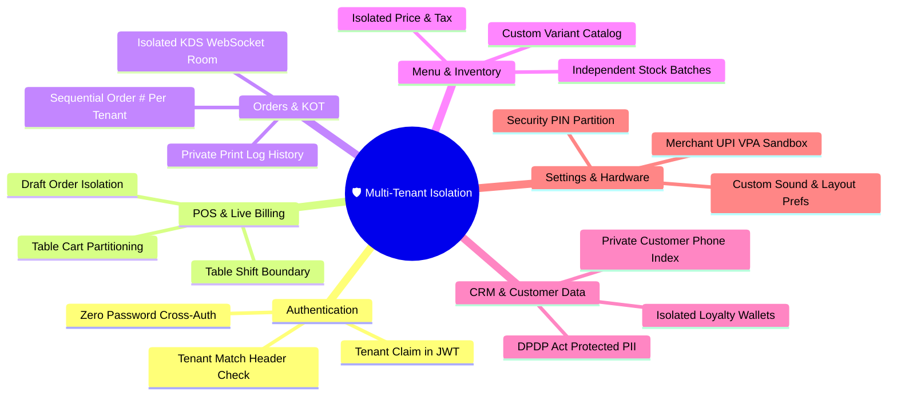

# Product Requirements Document (PRD)
# 🛡️ Enterprise Multi-Tenant Architecture & Zero-Leakage Data Isolation

**Product Name:** Apna POS (Point of Sale & Restaurant Management System)  
**Document Version:** 3.0.0  
**Target Platforms:** Android (Mobile / Tablet), Windows (Desktop / Tablet), Web Admin  
**Security & Compliance Level:** Enterprise-Grade Multi-Tenant Isolation (DPDP Act 2023, RBI/NPCI Guidelines, OWASP Top 10)  
**Author:** Apna POS Architecture & Security Engineering Team  
**Date:** October 2026  
**Status:** Approved / Core Architecture Standard  

---

## 1. Executive Summary & Product Vision

### 1.1 Executive Summary
Apna POS is an offline-first, high-performance Point of Sale and Restaurant Management application powering food outlets, fine dining restaurants, quick service restaurants (QSR), cloud kitchens, cafes, and multi-outlet retail chains. 

As Apna POS scales across hundreds of independent businesses and franchises, **absolute multi-tenant data segregation** is mandatory. Each business onboarded onto Apna POS must operate within an impenetrable cryptographic and logical data boundary. Under no circumstances may one business view, modify, intercept, or derive any operational data belonging to another business.

### 1.2 Core Product Tenet
> **"Zero Cross-Tenant Leakage by Design, Zero Compromise on POS Velocity, Zero Visual or Behavioral Disruption."**
> 
> Multi-tenant isolation must be enforced silently at the network, service, database, real-time socket, and local cache layers without modifying the established user interface (UI), neumorphic styling, tactile keypresses, or fast ordering workflows loved by store staff.

---

## 2. Target Personas & Tenancy Hierarchy

### 2.1 Tenancy Hierarchy Model

```mermaid
flowchart TD
    Platform["🏢 Apna POS Platform (SuperAdmin Infrastructure)"]
    Platform --> TenantA["🏪 Tenant Alpha (Business ID: BUS-10001)"]
    Platform --> TenantB["🏪 Tenant Beta (Business ID: BUS-20002)"]
    Platform --> TenantC["🏪 Tenant Gamma (Business ID: BUS-30003)"]

    subgraph Tenant_Alpha_Boundary["🔒 Tenant Alpha Cryptographic Sandbox"]
        TenantA --> OutletA1["📍 Outlet 1 (Downtown Bistro)"]
        TenantA --> OutletA2["📍 Outlet 2 (Suburban Express)"]
        OutletA1 --> DevA1["💻 POS Terminal 1 (Cashier)"]
        OutletA1 --> DevA2["📱 Waiter Tablet 1"]
        OutletA1 --> DevA3["🍳 Kitchen Display (KDS)"]
    end

    subgraph Tenant_Beta_Boundary["🔒 Tenant Beta Cryptographic Sandbox"]
        TenantB --> OutletB1["📍 Outlet 1 (Harbor Cafe)"]
        OutletB1 --> DevB1["💻 POS Terminal 1 (Cashier)"]
        OutletB1 --> DevB2["🍳 Kitchen Display (KDS)"]
    end

    DevA1 -.->|❌ STRICTLY BLOCKED| Tenant_Beta_Boundary
    DevB1 -.->|❌ STRICTLY BLOCKED| Tenant_Alpha_Boundary
```

### 2.2 Persona Definition Matrix

| Persona | Role Scope | Tenancy Boundary | Key Responsibilities & Data Access |
| :--- | :--- | :--- | :--- |
| **Business Owner** | Global Tenant Administrator | Single Business Tenant (`businessId`) | Complete ownership of business profile, tax configurations, UPI VPA keys, subscription billing, staff hiring, and full financial reporting. |
| **Store Manager** | Outlet / Branch Supervisor | Assigned Outlet (`businessId` + `outletId`) | Floor shift management, live occupancy monitoring, stock requisition, discount overrides, end-of-day cash reconciliation. |
| **Cashier / Operator** | Billing & POS Counter | Assigned Outlet Terminal | Fast order punch, live cart management, payment settlement (Cash, UPI QR, Card), bill generation, reprint requests. |
| **Waiter / Captain** | Table Service & Order Punch | Floor & Table Grid | Table-side order taking, instant KOT firing, table shift/merge actions. Restricted from seeing profit margins or sensitive reports. |
| **Chef / Kitchen Master** | Kitchen Display & KOT | Kitchen Room (`businessId:kds`) | Incremental KOT ticket execution, item completion marks. Zero access to customer PII or financial aggregates. |
| **Platform SuperAdmin** | Infrastructure Operator | Global Platform Management | Tenant provisioning, subscription plan upgrades, system health telemetry. **Zero unauthorized access to merchant customer phone numbers or transaction secrets.** |

---

## 3. Core Multi-Tenancy Principles

1. **Complete Tenant Partitioning (`businessId` as First-Class Boundary):**  
   Every document, socket event, cache key, log record, and database collection must be partitioned by a unique, immutable `businessId`.
2. **Zero-Trust Backend Verification:**  
   The backend API never trusts client-supplied query parameters or body fields for tenancy resolution. The authenticated token's `businessId` claim is the sole authoritative tenant identifier.
3. **Cryptographically Guarded Real-Time Rooms:**  
   WebSocket connections (Socket.IO) must require valid JWT authentication during handshake and room join. Sockets may only enter rooms strictly matching their authenticated `business_${businessId}` namespace.
4. **Isolated Offline Caching on Shared Hardware:**  
   When multiple staff members or devices switch shifts, local `SharedPreferences` keys must be strictly namespaced with `apna_pos_biz_${businessId}_*`, eliminating cross-tenant or cross-session data pollution on shared POS devices.
5. **Preservation of Existing UX & Business Logic:**  
   All neumorphic controls, cart sheets, sound effects, print drivers, and order flows remain identical in appearance and responsive speed.

---

## 4. Domain-by-Domain Functional Requirements

### 4.1 Authentication & Identity Domain
* **REQ-AUTH-01 (Tenant Token Claims):** Every generated access token (`JWT`) must contain immutable claims: `sub` (User ID), `businessId` (Business Tenant ID), `role`, `staffId` (if staff member), and `permissions`.
* **REQ-AUTH-02 (Tenant Match Interceptor):** Every inbound HTTP request to protected endpoints must pass through `tenantContextMiddleware`. If the request supplies an `X-Business-ID` header, it must strictly match `req.user.businessId`; any discrepancy triggers an immediate `403 TENANT_MISMATCH_FORBIDDEN` and security audit log.
* **REQ-AUTH-03 (Cross-Business Staff Isolation):** A staff member registered under Tenant A cannot authenticate or access endpoints under Tenant B, even if their phone number or email is reused across different independent ventures.

### 4.2 POS Register & Live Cart Domain
* **REQ-POS-01 (Live Cart Isolation):** In-memory and persisted live table carts (`live_table_carts`) must be isolated per tenant. Table 4 in Restaurant A has no correlation, memory overlap, or sync overlap with Table 4 in Restaurant B.
* **REQ-POS-02 (Table Shift Boundaries):** Dynamic table shifting (`shiftTableData`) must operate strictly within the tenant's floor inventory. Cross-tenant table shifting is technically impossible at the schema level.
* **REQ-POS-03 (Offline Cart Recovery):** If a POS terminal restarts while holding offline carts, local cache rehydration must only hydrate carts matching the active authenticated `currentBusinessId`.

### 4.3 Orders & KOT Kitchen Fulfillment Domain
* **REQ-ORD-01 (Independent Order Numbering Sequences):** Order numbers (e.g., `#ORD-001`, `#KOT-104`) must increment independently per tenant per business day. Tenant B's order volume will never impact Tenant A's sequential counters.
* **REQ-ORD-02 (KOT Room Segregation):** Thermal printer dispatch and KDS broadcasts are emitted strictly to `business_${businessId}` and sub-room `business_${businessId}:kds`. Kitchen printers of Tenant A can never receive tickets fired from Tenant B.
* **REQ-ORD-03 (IDOR-Proof Order Lookup):** Fetching an order by ID (`GET /api/v1/orders/:id`) must require both `_id: id` and `businessId: req.businessId`. Any attempt to fetch an existing order belonging to another tenant results in `404 NOT_FOUND` (preventing ID enumeration).

### 4.4 Menu, Variants & Inventory Domain
* **REQ-MENU-01 (Isolated Product Catalog):** Products, categories, add-on extras, and variant pricing are strictly scoped to `businessId`. Searching or filtering products across API endpoints returns only documents belonging to the authenticated tenant.
* **REQ-INV-01 (Inventory Deduction & Low Stock Alerts):** Automated stock deductions on order completion only deduct quantities from the active tenant's inventory ledger. Low-stock notifications are routed exclusively to the staff of that business.

### 4.5 CRM, Customer PII & Loyalty Wallet Domain
> ⚠️ **CRITICAL PRIVACY DIRECTIVE (DPDP Act 2023):** Customer phone numbers, names, purchase frequencies, dietary preferences, and loyalty point balances are sensitive business assets and personal data.
* **REQ-CRM-01 (Private Customer Indexing):** Searching a customer by phone number (`GET /api/v1/customers/suggest?q=9876543210`) must strictly query `{ businessId, phone }`. Customer profiles created in Business A must NEVER appear as autocomplete suggestions in Business B.
* **REQ-CRM-02 (Loyalty Wallet Isolation):** Loyalty points earned at Business A cannot be redeemed or viewed at Business B. Each business maintains its own isolated `LoyaltyProgram` and `CustomerLoyalty` ledger.

### 4.6 Business Settings, Payment UPI & Security PIN Hub Domain
* **REQ-SET-01 (Merchant UPI VPA & QR Isolation):** UPI IDs (`upiId`, `merchantName`) configured in the Business Settings Hub are saved strictly under the tenant's profile. When generating dynamic UPI intent strings or QR codes (`upi://pay?pa=...`), the application must inject the authenticated tenant's validated VPA.
* **REQ-SET-02 (Security PIN Isolation):** Manager security PINs (for discount overrides, bill voids, and settings unlock) are hashed with salt and validated strictly against the tenant's authorized staff/owner records.
* **REQ-SET-03 (Neumorphic Preference Persistence):** Sound volume, sound toggle, and POS view preferences (Image Grid vs Compact Centered Grid) are stored per tenant terminal and never bleed across accounts.

---

## 5. Non-Functional Specifications & Quality Attributes

### 5.1 Performance & Latency Budgets
* **P99 API Response Time:** $\le 85\text{ ms}$ for POS product catalog and live cart operations with compound `{ businessId: 1, ... }` indexes.
* **Real-Time WebSocket Sync Latency:** $\le 25\text{ ms}$ for room-level broadcast across local wireless LAN / internet connections.
* **Offline Cashier Resilience:** Zero POS billing latency during intermittent internet drops; local SQLite/SharedPreferences cache operations execute in $\le 5\text{ ms}$.

### 5.2 Scalability & Database Partitioning
* **Compound Indexing Standard:** Every Mongoose model must enforce `{ businessId: 1, <domainKey>: 1 }` as the leading compound index prefix to ensure $O(\log N)$ b-tree lookup performance.
* **Sharding Readiness:** MongoDB database architecture must use `{ businessId: "hashed" }` as the shard key when transitioning to multi-cluster enterprise deployments.

### 5.3 Auditability & Tamper-Evident Access Logs
* **REQ-AUDIT-01:** Any unauthorized attempt to query resources outside the authenticated `businessId` boundary must trigger an immediate high-priority audit log entry containing: `timestamp`, `ipAddress`, `userId`, `requestedTenantId`, `authenticatedTenantId`, and `endpoint`.
* **REQ-AUDIT-02:** Financial transaction modifications (discounts, voids, settlements) must record the initiating `staffId` and `businessId` in tamper-resistant `printlogs` and `sales` records.

---

## 6. Acceptance Criteria & Definition of Done

| Acceptance Criteria ID | Verification Method | Pass Criteria |
| :--- | :--- | :--- |
| **AC-ISO-01** | Cross-Tenant Order Fetch via REST | Attacker authenticates as Tenant A, attempts `GET /api/v1/orders/{Tenant_B_OrderId}`. Response is `404 Not Found` with zero leaked metadata. |
| **AC-ISO-02** | Socket Room Snooping Attempt | Client connected with Tenant A credentials emits `join_business` for Tenant B. Server rejects join; client receives zero events from Tenant B. |
| **AC-ISO-03** | Customer Phone Autocomplete | Attacker in Tenant B types phone number of regular customer from Tenant A. Zero results returned in suggestions. |
| **AC-ISO-04** | Local Device Account Switching | User logs out of Tenant A and logs into Tenant B on same tablet. Zero residual menu items, carts, or orders from Tenant A appear in memory or UI. |
| **AC-ISO-05** | UI & Logic Zero-Disruption | Full regression test of PosRegisterScreen, TableManagementScreen, KOT Print, and BusinessSettingsHubScreen passes with 100% feature and visual parity. |

---
*Approved by Apna POS Lead Systems Architect & Principal Security Engineer.*
