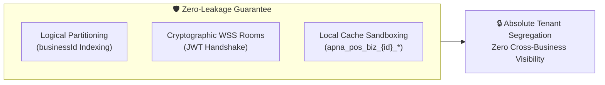
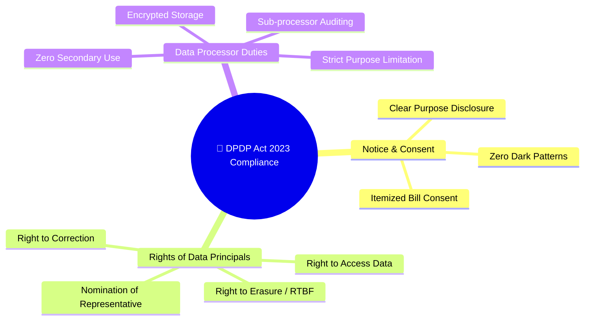
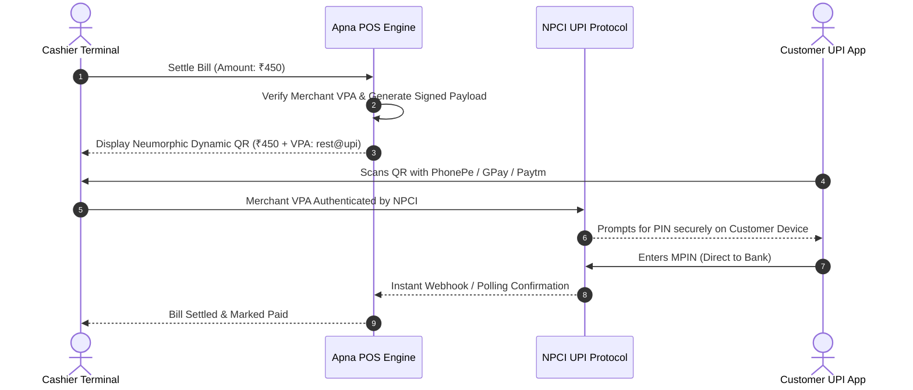

# Apna POS Security Policy, Data Protection Agreement & Merchant Terms of Service
# 🛡️ Terms & Conditions of Security, Multi-Tenant Data Segregation & Regulatory Compliance

**Effective Date:** October 6, 2026  
**Document Version:** 3.0.0  
**Governing Laws:** Digital Personal Data Protection Act, 2023 (India DPDP Act) | Information Technology Act, 2000 | RBI Master Directions on Payment Aggregators & Merchant POS | NPCI UPI Procedural Guidelines  
**Applicability:** All Apna POS Merchants, Franchisees, Subscribed Businesses, and Authorized Operators  

---

## 1. Preamble & Definitions

This Document constitutes the legally binding Security Policy, Data Protection Agreement (DPA), and Terms & Conditions between **Apna POS Technologies** ("Platform Provider", "We", "Us") and the onboarded business entity ("Merchant", "Tenant", "Business User", "You").

### 1.1 Definitions
* **"Tenant"**: An independent business registered on Apna POS, uniquely identified by an authoritative `businessId`.
* **"Tenant Data"**: All menu items, prices, sales records, customer lists, phone numbers, table maps, tax GSTINs, and staff profiles created under a specific `businessId`.
* **"Cross-Tenant Leakage"**: Any unauthorized viewing, querying, transmitting, or processing of one Tenant's Data by another Tenant or third party.
* **"Data Fiduciary"**: The Merchant, who determines the purpose and means of processing personal customer data.
* **"Data Processor"**: Apna POS, which processes customer and merchant data solely on behalf of the Data Fiduciary.
* **"Data Principal"**: The individual whose personal data is collected (e.g., end-customers ordering food, restaurant employees).

---

## 2. Multi-Tenant Data Segregation Guarantee & Service Level Agreement (SLA)

### 2.1 The Absolute Zero-Leakage Guarantee
1. **Cryptographic & Logical Isolation:** Apna POS guarantees that all Tenant Data is segregated using strict multi-tenant boundaries. Under no operational condition will one Merchant have access to another Merchant's sales volumes, profit margins, customer phone numbers, menu pricing, or operational logs.
2. **Automated Query Enforcement:** The platform implements server-side fail-closed tenant scoping across all REST API endpoints, Socket.IO real-time channels, and Cloud Firestore rules. If a request lacks an authoritative tenant context, access is instantly denied.
3. **Availability SLA:** Apna POS commits to a **99.9% uptime SLA** for core cloud synchronization and real-time order processing services, excluding scheduled maintenance announced 48 hours in advance.
4. **Breach Indemnification:** In the event of a verified cross-tenant data leak caused directly by a proven defect in the Apna POS software architecture, Apna POS will take immediate remediation measures and cooperate fully with regulatory forensic authorities.

---

## 3. Merchant Data Ownership & Intellectual Property

### 3.1 100% Merchant Ownership
* **Exclusive Merchant Property:** The Merchant retains complete, exclusive, and unencumbered ownership of all intellectual property, data assets, recipes, custom pricing, sales ledgers, customer phone databases, and employee records entered into Apna POS.
* **No Platform Claim:** Apna POS claims zero ownership over Merchant Data.

### 3.2 Non-Monetization & Non-Disclosure Commitment
* **No Data Selling or Renting:** Apna POS will **NEVER sell, rent, license, or monetize** Merchant customer phone numbers, ordering patterns, or sales metrics to third-party aggregators, advertisers, or competing restaurants.
* **No Algorithmic Predation:** Apna POS will never use one Merchant's proprietary menu pricing or high-performing dish data to advise or benefit a direct competitor within the same geographic vicinity.

---

## 4. Data Protection & Regulatory Compliance (India DPDP Act 2023 & GDPR)

### 4.1 Merchant Obligations as Data Fiduciary
1. **Notice & Lawful Consent:** When collecting customer phone numbers for digital billing, loyalty points, or SMS receipts, the Merchant must inform the customer of the purpose and obtain lawful consent.
2. **Purpose Limitation:** Customer personal data collected via Apna POS may only be used for restaurant billing, table booking, food delivery, and authorized promotional loyalty messages.
3. **Respect for Data Principal Rights:**
   * **Right to Access & Correction:** If a customer requests a copy or correction of their profile details, the Merchant must execute this via the Customer Management module.
   * **Right to Erasure (Right to be Forgotten):** If a customer requests deletion of their personal information, the Merchant and Apna POS must erase their name, phone, and address from active databases within 30 days, subject to mandatory tax retention laws.

### 4.2 Apna POS Obligations as Data Processor
1. **Technical Safeguards:** All personal data in transit is encrypted using TLS 1.3. Sensitive data at rest is encrypted using AES-256.
2. **Zero Secondary Processing:** Apna POS processes personal data solely to execute the features configured by the Merchant (e.g., printing bills, calculating loyalty points).
3. **Employee Access Governance:** Apna POS support personnel have no direct access to production merchant databases without explicit, time-bounded, dual-authorized access logs for troubleshooting.

---

## 5. Payment Security & RBI / NPCI Guidelines (UPI, Cards & Cash)

### 5.1 Zero Sensitive Payment Authentication Data (SAD) Storage
In strict accordance with Reserve Bank of India (RBI) directives:
1. **No UPI MPIN Storage:** Apna POS **NEVER asks for, intercepts, logs, or stores** a customer's UPI PIN or MPIN under any circumstance.
2. **No Card Data Retention:** Apna POS does not store credit/debit card numbers (PAN), CVVs, or card expiry dates on local POS devices or remote servers. All card payments are processed via RBI-authorized payment aggregators or external POS hardware terminals.

### 5.2 Dynamic UPI QR Code Security

1. **Merchant VPA Integrity:** Merchants must configure and verify their authentic Virtual Payment Address (VPA / UPI ID) in the Business Settings Hub.
2. **Tamper-Evident Intent String:** All generated UPI QR codes strictly follow the NPCI specification: `upi://pay?pa={merchant_vpa}&pn={merchant_name}&am={amount}&tr={order_id}&cu=INR`.
3. **Liability for Incorrect VPA:** The Merchant is solely responsible for ensuring the accuracy of their entered UPI ID in the Business Settings Hub. Apna POS is not liable for misdirected customer payments resulting from a Merchant typing an incorrect personal UPI ID.

---

## 6. Merchant Security Responsibilities & PIN Hygiene

To maintain the integrity of the multi-tenant sandbox, the Merchant agrees to adhere to the following operational standards:

### 6.1 Role-Based Access Control (RBAC) Enforcement
* **Separation of Roles:** The Merchant must assign staff to their appropriate roles:
  * *Waiters*: Restricted to table ordering and KOT firing.
  * *Cashiers*: Restricted to billing and settlement.
  * *Managers / Owners*: Authorized for voiding bills, applying manual discounts, and modifying business profile settings.
* **Prohibition of Credential Sharing:** Staff members must not share passwords or access PINs. Actions performed under a staff account are legally attributed to that staff member.

### 6.2 Security PIN Protocol
* **Manager Security PIN:** Critical actions—including deleting items from running KOTs, applying discounts exceeding 20%, modifying GST tax rates, and unlocking business UPI settings—require the entry of the 4-to-6 digit Manager Security PIN.
* **PIN Confidentiality:** The Merchant must not disclose the Master PIN to unauthorized floor staff. The PIN should be updated regularly via the Neumorphic Business Settings Hub.

### 6.3 Physical Device Security & Stolen Device Revocation
* If a POS tablet or smartphone running Apna POS is lost or stolen, the Merchant must immediately log in from another terminal and revoke the lost device session to invalidate all active local tokens.

---

## 7. Security Incident Management & Breach Notification

### 7.1 Incident Classification
A Security Incident is defined as any confirmed event that compromises the confidentiality, integrity, or availability of Tenant Data, including unauthorized cross-tenant data access or credential compromise.

### 7.2 72-Hour Rapid Notification Protocol
In the event of a confirmed data breach impacting Merchant or Customer personal data:
1. **Immediate Notification:** Apna POS will notify affected Merchants in writing within **72 hours** of becoming aware of the incident, in compliance with DPDP Act 2023 and CERT-In guidelines.
2. **Incident Report Contents:** The notification will specify:
   * Nature and scope of the breach.
   * Categories of data and approximate number of Data Principals affected.
   * Immediate containment measures executed.
   * Recommended mitigation steps for the Merchant.
3. **Forensic Audit:** Apna POS will conduct a comprehensive forensic root-cause analysis and deploy necessary security patches without commercial delay.

---

## 8. Data Retention, Backup, Archival & Account Termination

### 8.1 Statutory Data Retention (Tax Compliance)
* Under applicable Indian Goods and Services Tax (GST) rules, financial sales records, tax invoices, and credit notes must be retained for a minimum of **72 months (6 years)** from the date of filing annual returns.
* Apna POS maintains encrypted archives of completed sales logs to assist Merchants in meeting statutory audit obligations.

### 8.2 Account Termination & Portable Data Export
* **Right to Data Portability:** Upon cancellation or termination of an Apna POS subscription, the Merchant has the right to download their complete dataset (Menu items, Sales history, Customer ledger, Inventory balances) in open, machine-readable formats (CSV and JSON).
* **Zero-Trace Cryptographic Deletion:** Within **30 days** of receiving a formal account termination request and after the mandatory export window expires, Apna POS will permanently delete or cryptographically sanitize all Merchant operational records from production databases and active caches, retaining only records mandated by applicable law.

---

## 9. Audit Rights, Dispute Resolution & Governing Law

### 9.1 Right to Security Telemetry
Merchants may request a summary report of security logs and active session histories associated with their `businessId` to verify internal staff compliance.

### 9.2 Governing Law & Jurisdiction
These Terms and Security Conditions shall be governed by and construed in accordance with the laws of the Republic of India. Any disputes arising hereunder shall be subject to the exclusive jurisdiction of the competent courts in **New Delhi, India**, following a mandatory 30-day amicable conciliation period.

---

*By creating an account, onboarding a business, or utilizing the Apna POS application, the Merchant acknowledges, accepts, and agrees to be bound by these Security Terms & Conditions in full.*
