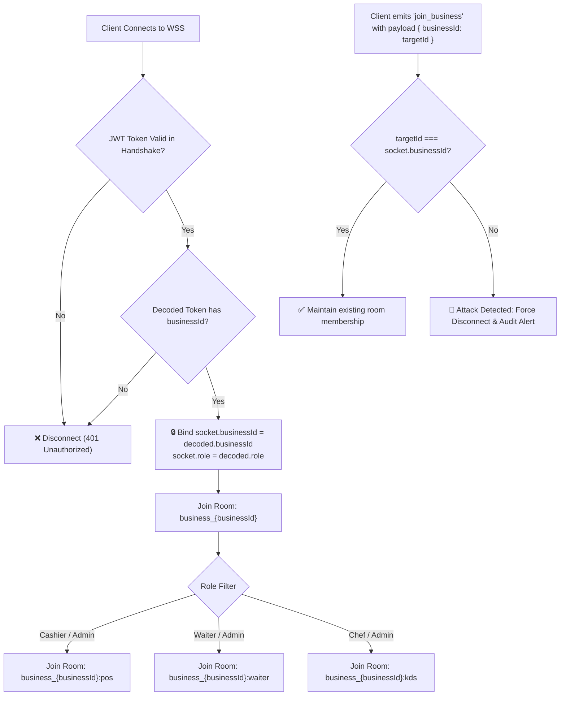
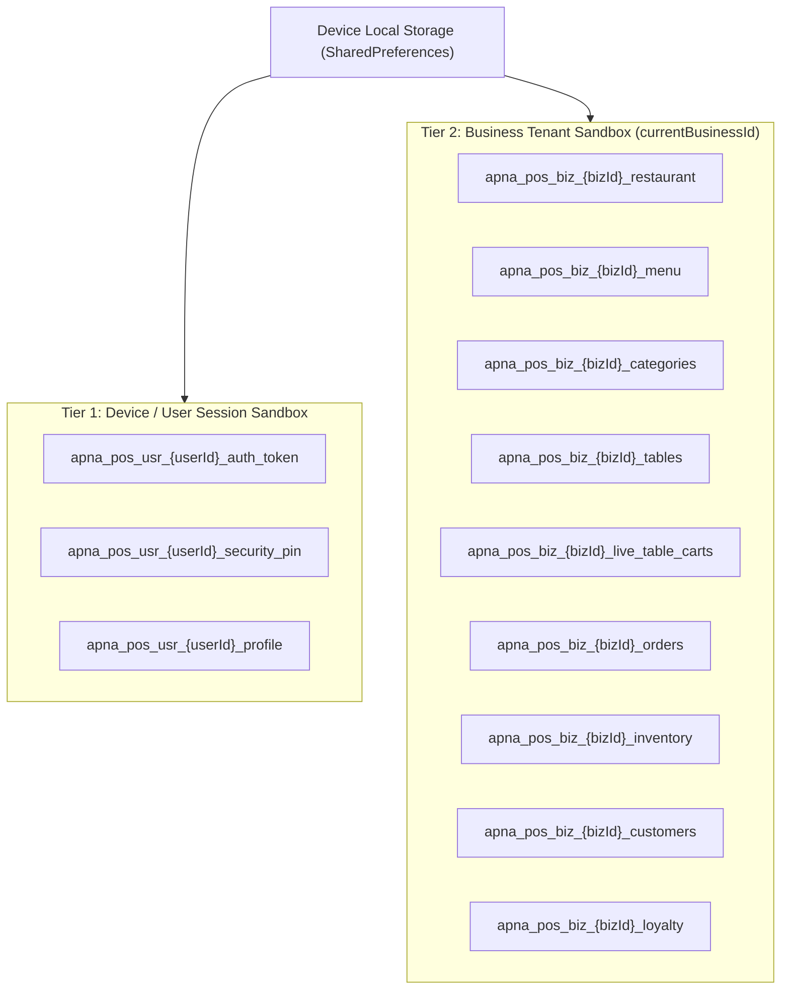
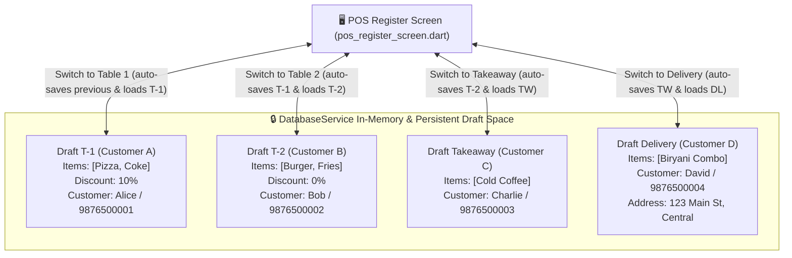
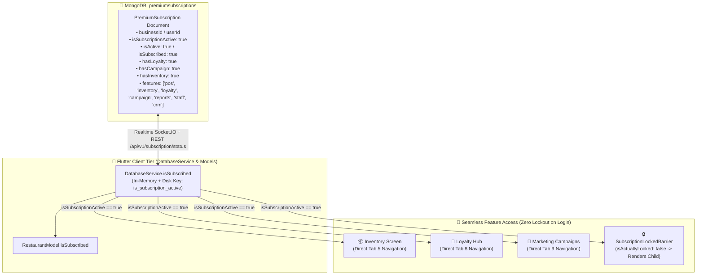
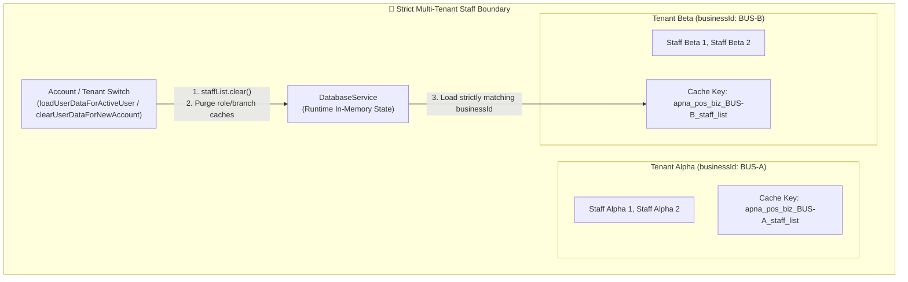

# System Architecture & Technical Design Document
# 🏗️ Apna POS Multi-Tenant Enterprise Architecture & Data Isolation

**System:** Apna POS (Point of Sale & Restaurant Management System)  
**Document Version:** 3.0.0  
**Target Architecture:** Multi-Tenant Offline-First Hybrid Cloud Architecture  
**Primary Tech Stack:** Flutter (Dart ^3.6.0) | Node.js / Express | MongoDB & Mongoose | Socket.IO | Cloud Firestore  
**Date:** October 2026  
**Status:** Approved Engineering Blueprint  

---

## 1. High-Level System Architecture & Topology

Apna POS is structured as an **Offline-First Multi-Tenant Hybrid System**. The presentation layer runs natively on client devices (Android Mobile/Tablet, Windows Desktop, POS Terminals), interfacing with an enterprise Node.js/Express API Gateway, real-time WebSocket cluster, MongoDB document store, and Cloud Firestore hybrid sync layer.

```mermaid
flowchart TD
    subgraph Client_Tier["🖥️ Client Tier (Flutter Multi-Platform Frontend)"]
        A1["POS Billing Register\n(pos_register_screen.dart)"]
        A2["Table & Floor Manager\n(table_management_screen.dart)"]
        A3["Orders & KDS Terminal\n(orders_screen.dart)"]
        A4["Neumorphic Settings Hub\n(business_settings_hub_screen.dart)"]
        
        subgraph Local_Cache["🔒 Local Isolated Storage"]
            L1["DatabaseService Cache\napna_pos_biz_{bizId}_*"]
            L2["Encrypted Secure Storage\n(Tokens, Hardware Keys)"]
        end
        A1 & A2 & A3 & A4 <--> L1
        A1 & A4 <--> L2
    end

    subgraph Gateway_Tier["🛡️ Network & Gateway Tier"]
        GW["Reverse Proxy / SSL Termination\n(Nginx / Cloudflare)"]
        MW1["Rate Limiter & DDOS Guard"]
        MW2["JWT Authentication Guard\n(authMiddleware.js)"]
        MW3["Tenant Context Interceptor\n(tenantContextMiddleware.js)"]
        GW --> MW1 --> MW2 --> MW3
    end

    subgraph Service_Tier["⚡ Backend Application Services (Node.js / Express)"]
        S_ORD["Order & KOT Service\n(orderService.js)"]
        S_PRD["Product & Menu Service\n(productService.js)"]
        S_TBL["Table & Floor Service\n(tableService.js)"]
        S_CRM["CRM & Loyalty Service\n(customerService.js)"]
        S_SET["Settings & UPI Service\n(businessService.js)"]
        
        MW3 --> S_ORD & S_PRD & S_TBL & S_CRM & S_SET
    end

    subgraph Realtime_Tier["📡 Real-Time WebSocket Cluster (Socket.IO)"]
        SOC["Socket.IO Service (socketService.js)\nJWT Handshake & Cryptographic Room Guard"]
        R_ROOM1["Room: business_BUS101 (Tenant A)"]
        R_ROOM2["Room: business_BUS202 (Tenant B)"]
        SOC --> R_ROOM1
        SOC --> R_ROOM2
    end

    subgraph Data_Tier["🍃 MongoDB Enterprise Database (Tenant Discriminator + Indexes)"]
        PLUGIN["Mongoose Global Tenant Isolation Plugin\n(tenantIsolationPlugin.js - Auto Query Injection)"]
        
        subgraph Collections["🗂️ Indexed Tenant Collections"]
            D_ORD[("orders\n{ businessId: 1, ... }")]
            D_PRD[("products\n{ businessId: 1, ... }")]
            D_TBL[("tables\n{ businessId: 1, ... }")]
            D_CUST[("customers\n{ businessId: 1, ... }")]
            D_SALE[("sales\n{ businessId: 1, ... }")]
        end
        
        S_ORD & S_PRD & S_TBL & S_CRM & S_SET --> PLUGIN --> Collections
    end

    subgraph Cloud_Sync["🔥 Cloud Firestore (Real-Time Subcollections)"]
        FS_RULE["Firestore Security Rules\n(businesses/{bizId}/* strictly checked)"]
        FS_DATA[("Firestore Documents\n/businesses/{bizId}/...")]
        FS_RULE --> FS_DATA
    end

    L1 <==>|REST API (HTTPS + X-Business-ID)| GW
    L1 <==>|WSS (JWT Auth Handshake)| SOC
    L1 <==>|Firebase SDK (Strict Token Auth)| FS_RULE
```

---

## 2. Multi-Tenancy Strategy & Architectural Pattern

### 2.1 Evaluated Architectural Patterns

| Architecture Model | Implementation Mechanism | Pros | Cons | Apna POS Decision |
| :--- | :--- | :--- | :--- | :--- |
| **Model 1: Database-per-Tenant** | Each business has an isolated MongoDB database (e.g., `apna_pos_biz_001`). | Highest physical isolation; zero accidental cross-querying. | Connection pool exhaustion in Node.js with hundreds of tenants; expensive scaling. | Reserved for Enterprise White-Label Franchise tiers. |
| **Model 2: Collection-per-Tenant** | Dynamic collection names per tenant (e.g., `orders_biz_001`). | Separation of physical files on disk. | High MongoDB namespace overhead; schema migrations are extremely complex. | Rejected. |
| **Model 3: Shared Database, Shared Collections with Discriminator Key + Compound B-Tree Indexing + Global Mongoose Guard** | Every document contains an indexed `businessId: ObjectId`. A global Mongoose plugin automatically injects `{ businessId }` into all queries. | Highly efficient connection pooling; predictable indexing; horizontal sharding on `{ businessId: "hashed" }`. | Requires foolproof middleware and plugin guard to eliminate IDOR. | **Selected & Standardized for Core Platform.** |

### 2.2 The Zero-Trust Mongoose Tenant Isolation Plugin

To guarantee that no developer omission can ever cause a cross-tenant data leak, a global Mongoose plugin (`tenantIsolationPlugin.js`) is installed across all tenant-scoped schemas.

```mermaid
sequenceDiagram
    autonumber
    actor Dev as Controller / Service Code
    participant Plugin as Mongoose Tenant Plugin
    participant Query as Mongoose Query / Pipeline
    participant Mongo as MongoDB Engine

    Dev->>Plugin: Order.find({ orderType: 'dineIn' }) [Context: tenantId = '66f4a1...']
    activate Plugin
    Plugin->>Plugin: Inspect Query Context
    alt Tenant Context Present
        Plugin->>Query: Inject { businessId: '66f4a1...', orderType: 'dineIn' }
        Query->>Mongo: Execute Scoped Query with Index Scan
        Mongo-->>Dev: Returns Tenant-Only Documents
    else Tenant Context Missing & Not SuperAdmin
        Plugin-->>Dev: THROW ApiError.forbidden('TENANT_CONTEXT_MISSING')
        Note over Plugin,Dev: Operation aborted; zero database access permitted
    end
    deactivate Plugin
```

#### Plugin Operational Mechanics:
1. **Query Pre-Hook (`find`, `findOne`, `findOneAndUpdate`, `updateMany`, `deleteMany`, `countDocuments`):**  
   Automatically executes:
   ```javascript
   schema.pre(['find', 'findOne', 'findOneAndUpdate', 'updateMany', 'deleteMany', 'countDocuments'], function() {
     const tenantId = this.options?._tenantId;
     if (!tenantId && !this.options?._bypassTenantCheck) {
       throw new Error('[Security Exception] Query executed without explicit tenant context');
     }
     if (tenantId) {
       this.where({ businessId: tenantId });
     }
   });
   ```
2. **Aggregation Pre-Hook (`aggregate`):**  
   Inspects the pipeline array. Injects `{ $match: { businessId: tenantId } }` as the first pipeline stage.
3. **Save Pre-Hook (`save`, `validate`):**  
   Validates that `doc.businessId` is non-null, matches the active tenant context, and cannot be mutated on existing documents.

---

## 3. Cryptographic Identity & Context Propagation

### 3.1 JWT Token Claims Standard

The JWT access token issued at `/api/v1/auth/login` contains the following cryptographic payload:

```json
{
  "sub": "66f4a1000000000000000001",
  "businessId": "66f4a1000000000000000002",
  "outletId": "66f4a1000000000000000003",
  "role": "cashier",
  "staffId": "66f4a1000000000000000004",
  "permissions": ["pos_billing", "orders_read", "table_shift"],
  "iat": 1728211200,
  "exp": 1728297600,
  "jti": "d3b07384-d113-40a2-a9b0-9f5b66d6a693"
}
```

### 3.2 Dual-Check Inbound HTTP Request Pipeline

Every client request carries:
* `Authorization: Bearer <AccessToken>`
* `X-Business-ID: <CurrentBusinessId>`
* `X-Device-ID: <UUID>`

```mermaid
sequenceDiagram
    autonumber
    actor Client as Flutter POS Terminal
    participant Gateway as Express Gateway (Nginx)
    participant AuthMW as authMiddleware.js
    participant TenantMW as tenantContextMiddleware.js
    participant Service as Business Service

    Client->>Gateway: POST /api/v1/orders<br/>Headers: [Bearer Token, X-Business-ID: B-101]
    Gateway->>AuthMW: Validate Bearer JWT Token
    AuthMW->>AuthMW: Verify Signature & Decode Claims
    AuthMW->>TenantMW: req.user = decoded; req.businessId = decoded.businessId
    
    TenantMW->>TenantMW: Verify X-Business-ID against req.businessId
    alt Headers Match (B-101 == B-101)
        TenantMW->>Service: Forward request with bound req.businessId
        Service-->>Client: 201 Created (Order processed within Tenant sandbox)
    else Tenant Mismatch (Attacker Spoofing: B-101 != B-999)
        TenantMW-->>Client: 403 Forbidden [Code: TENANT_MISMATCH_FORBIDDEN]
        Note over TenantMW: Security alert logged to SIEM
    end
```

---

## 4. Real-Time WebSocket Isolation Architecture (Socket.IO)

### 4.1 Identified Vulnerability in Prior Version
In the legacy implementation, `socketService.js` accepted an unverified `join_business` event from clients and fell back to unauthenticated connections when tokens expired, allowing potential room spoofing:
```javascript
// LEGACY FLAW: Insecure room joining
socket.on('join_business', (data) => {
  const bId = data?.businessId;
  this.joinBusinessRoom(socket, bId); // UNVERIFIED!
});
```

### 4.2 Hardened Cryptographic Handshake & Room Boundaries

Under the hardened architecture:
1. **Mandatory Handshake Verification:** Handshake without a cryptographically valid JWT signature is rejected immediately with an authentication error.
2. **Deterministic Room Binding:** Upon authentication, the socket is bound *exclusively* to rooms derived from `decoded.businessId`.
3. **Rejection of Arbitrary Room Join:** The client cannot emit `join_business` with an arbitrary ID. Any `join_business` attempt must match `socket.businessId`, otherwise the socket is disconnected.



### 4.3 Real-Time Event Dispatch Partitioning Matrix

| Socket Event Name | Destination Room | Target Audience | Data Isolation Guarantee |
| :--- | :--- | :--- | :--- |
| `order:created` | `business_${bizId}:kds`, `business_${bizId}:pos` | Kitchen & Cashiers | Emitted exclusively to rooms prefixed with the order's verified `businessId`. |
| `table:updated` | `business_${bizId}` | All outlet terminals | Floor grid state broadcast strictly to that business's active devices. |
| `cart:synced` | `business_${bizId}:pos` | POS terminals | Live draft table carts synchronized only across cashiers of that tenant. |
| `stock:low_alert`| `business_${bizId}:pos` | Store Managers | Stock depletion alerts stay within the originating restaurant. |
| `subscription:changed` | `business_${bizId}` | Tenant Owner | Subscription unlock events reach only the owner's subscribed devices. |

---

## 5. Cloud Firestore Security Rules Architecture

For deployments utilizing Cloud Firestore for real-time offline sync, documents are organized under a strict hierarchical multi-tenant structure:

```
/databases/{database}/documents
  └── /businesses/{businessId}
        ├── /profile/{profileDoc}
        ├── /orders/{orderId}
        ├── /tables/{tableId}
        ├── /products/{productId}
        ├── /categories/{categoryId}
        └── /customers/{customerId}
```

### 5.1 Hardened Firestore Security Rules Definition

```javascript
rules_version = '2';
service cloud.firestore {
  match /databases/{database}/documents {
    
    // Global Helper: Check if user is authenticated with Firebase Auth
    function isAuthenticated() {
      return request.auth != null;
    }
    
    // Global Helper: Check if token businessId matches the document's businessId
    function isTenantMember(businessId) {
      return isAuthenticated() && 
        request.auth.token.businessId == businessId;
    }
    
    // Global Helper: Check if user has Owner / Admin role in the tenant
    function isTenantAdmin(businessId) {
      return isTenantMember(businessId) && 
        (request.auth.token.role == 'owner' || request.auth.token.role == 'admin');
    }

    // Business Root Document
    match /businesses/{businessId} {
      allow read: if isTenantMember(businessId);
      allow write: if isTenantAdmin(businessId);
      
      // Nested Tenant Subcollections
      match /{subcollection}/{document=**} {
        allow read: if isTenantMember(businessId);
        allow write: if isTenantMember(businessId);
      }
    }

    // User Profile Rules (Users can only read/write their own profile)
    match /users/{userId} {
      allow read, write: if isAuthenticated() && request.auth.uid == userId;
    }

    // Default Fallback: DENY ALL OTHER ACCESS (Zero Trust)
    match /{document=**} {
      allow read, write: if false;
    }
  }
}
```

---

## 6. Client-Side Flutter Cache & Local Storage Partitioning

### 6.1 Vulnerability in Legacy `DatabaseService`
In the legacy Flutter implementation:
```dart
// LEGACY FLAW: Scoped by userId instead of businessId
String _userKey(String baseKey) {
  final uid = currentUser?.id ?? 'guest';
  return 'apna_pos_${uid}_$baseKey';
}
```
*Issue:* If multiple staff members in the same restaurant logged in with different credentials, their live table carts and inventory caches split into fragmented silos. Conversely, if one user logged into multiple businesses, datasets risked cross-pollination.

### 6.2 Hardened Two-Tier Storage Key Architecture

The hardened `DatabaseService` enforces a strict two-tier storage key strategy:



#### Deterministic Storage Key Helper:
```dart
/// Tier 2: Resolves tenant-isolated key for business operational datasets
String _businessKey(String baseKey) {
  final bId = currentBusinessId.trim();
  return 'apna_pos_biz_${bId}_$baseKey';
}

/// Tier 1: Resolves user-isolated key for credential/session data
String _userKey(String baseKey) {
  final uId = (currentUser?.id != null && currentUser!.id.isNotEmpty) 
      ? currentUser!.id.trim() 
      : 'guest';
  return 'apna_pos_usr_${uId}_$baseKey';
}
```

### 6.3 Secure Store Switch & Logout Purge Protocol
When switching businesses or logging out:
1. All in-memory operational lists are immediately cleared:
   ```dart
   menuItems.clear();
   tables.clear();
   orders.clear();
   customers.clear();
   inventoryItems.clear();
   _holdOrders.clear();
   _liveTableCarts.clear();
   ```
2. The UI notifies listeners with clean empty states.
3. The new business dataset is loaded exclusively using `_businessKey(...)`.

---

## 7. MongoDB Collections & Compound Indexing Matrix

Every collection is indexed with `businessId` as the leading compound index prefix to ensure sub-millisecond query execution and zero table scans.

| Collection | Leading Compound Indexes | Purpose & Query Optimization |
| :--- | :--- | :--- |
| `businesses` | `{ _id: 1, ownerId: 1 }` | Fast tenant profile lookup |
| `products` | `{ businessId: 1, isAvailable: 1, category: 1 }`<br/>`{ businessId: 1, productId: 1 }` (Unique)<br/>`{ businessId: 1, name: "text" }` | Instant POS menu rendering, category tabs, and product search |
| `categories` | `{ businessId: 1, name: 1 }` (Unique)<br/>`{ businessId: 1, displayOrder: 1 }` | Ordered category list for POS top bar |
| `tables` | `{ businessId: 1, tableNumber: 1 }` (Unique)<br/>`{ businessId: 1, floor: 1, status: 1 }` | Floor-wise table occupancy grid |
| `orders` | `{ businessId: 1, createdAt: -1 }`<br/>`{ businessId: 1, orderNumber: 1 }`<br/>`{ businessId: 1, status: 1, createdAt: -1 }`<br/>`{ businessId: 1, tableNumber: 1 }` | Orders screen, live kitchen status, bill settlements |
| `carts` | `{ businessId: 1, tableNumber: 1 }`<br/>`{ businessId: 1, updatedAt: -1 }` | Multi-device draft cart synchronization |
| `customers` | `{ businessId: 1, phone: 1 }` (Unique)<br/>`{ businessId: 1, lastVisit: -1 }`<br/>`{ businessId: 1, name: 1 }` | Autocomplete suggestions and customer loyalty lookups |
| `inventories` | `{ businessId: 1, productId: 1 }`<br/>`{ businessId: 1, currentStock: 1 }` | Low-stock notifications and auto stock decrement |
| `sales` | `{ businessId: 1, date: -1 }`<br/>`{ businessId: 1, paymentMethod: 1 }` | End-of-day sales summary, tax ledger, analytics |
| `printlogs` | `{ businessId: 1, printedAt: -1 }`<br/>`{ businessId: 1, orderId: 1 }` | Audit trail for duplicate bill printing |
| `staffs` | `{ businessId: 1, phone: 1 }`<br/>`{ businessId: 1, role: 1 }` | Staff role verification and security PIN authentication |

---

## 8. Resilience, Disaster Recovery & High Availability

1. **Daily Automated Encrypted Snapshots:** Automated daily backups of MongoDB with AES-256 encryption at rest. Backups are tagged with tenant retention policies.
2. **Point-in-Time Recovery (PITR):** MongoDB oplog streaming enabled to support restore to any second within the past 7 days.
3. **Graceful Network Degradation:** If internet drops:
   - POS terminal continues billing locally into SQLite / SharedPreferences.
   - Sockets transition to offline queue buffer.
   - Upon reconnect, `DatabaseService.syncUnsyncedOrders()` pushes offline bills using transactional idempotency keys (`idempotencyKey: "${businessId}_${orderNumber}_${timestamp}"`), preventing duplicate bill creation.

---

## 9. Multi-Order & Multi-Table Draft Isolation Architecture

### 9.1 The Concurrent Multi-Order Taking Problem
In high-volume restaurant, cafe, and QSR environments, cashiers and floor captains handle multiple simultaneous customer interactions:
1. **Dine-In Table 1 (Customer A):** Server selects Table 1 and begins punching items, applying specific customer discounts, and recording customer name/phone.
2. **Dine-In Table 2 (Customer B):** While Table 1's party is deciding on desserts, another customer at Table 2 places an order.
3. **Takeaway & Counter Orders (Customer C):** Concurrently, a walk-in customer requests a quick takeaway order.
4. **Doorstep Delivery (Customer D):** A phone order is taken requiring customer delivery address, landmark, and pincode.



### 9.2 Key Invariants & Architectural Rules
1. **Isolated Draft State Containers in `DatabaseService`:**
   - `_liveTableCarts`: `Map<String, List<CartItem>>` — Maps normalized table/order key to list of active cart line items.
   - `_liveDraftCustomerInfo`: `Map<String, Map<String, dynamic>>` — Maps normalized key to customer details (`name`, `phone`, `appliedCoupon`, `couponDiscount`, `customDiscount`, `customDiscountType`, `loyaltyRedeemed`).
   - `_liveDraftDeliveryInfo`: `Map<String, Map<String, dynamic>>` — Maps normalized key to delivery address fields (`address`, `landmark`, `city`, `state`, `pincode`).
2. **Normalized Key Resolution Protocol (`isSameTable`):**
   Table identifiers are normalized across formats (`T-1`, `T1`, `Table 1`, `1`) to prevent key fragmentation:
   - Dine-In: Target table normalized key matching via `isSameTable(tableA, tableB)`.
   - Takeaway: Active Order ID or default `'Takeaway'`.
   - Delivery: Active Order ID or default `'Delivery'`.
3. **Table Switch vs Table Shift Contract:**
   - **Switch Table (Default Action on Table Tap):** Tapping any table card in the table management grid or floor modal triggers a *context switch*. The active draft is saved via `_saveCurrentDraft()`, and the destination table draft is loaded via `_loadCartForTable(newTable)`. Both tables remain active/occupied with zero data loss or item transfer.
   - **Shift Table (Explicit Action Only):** Table shifting is strictly restricted to an explicit user interaction via the "Shift Order" button. Invoking `DatabaseService.shiftTableData(sourceTable, targetTable)` migrates active orders, cart items, customer metadata, and discounts from source to destination, freeing the source table immediately.
4. **Independent Order Settlement & Release:**
   Settling or clearing Table 1 frees *only* Table 1 (`clearTableCartAndFree`) and purges its draft entry from memory and local storage, leaving Table 2, Takeaway, and Delivery drafts 100% intact.
5. **Offline Durability & Session Resilience (`SharedPreferences`):**
   Live table drafts are serialized to `apna_pos_biz_{bizId}_live_table_carts`. When the application restarts or crashes, all active table carts, customer names, phones, delivery addresses, and applied discounts are restored without data loss.

---

## 10. Unified Premium Subscription Architecture (Loyalty, Campaign, Inventory & Zero-Lock Login Protocol)

### 10.1 Unified Architecture Principles
To deliver a streamlined enterprise billing experience and eliminate friction across premium modules, **Loyalty Programs**, **Marketing Campaigns**, and **Advanced Inventory** are managed collectively under a single authoritative schema and collection: **`premiumSubscription`** (`premiumsubscriptions` in MongoDB).



### 10.2 Architectural Rules & Security Invariants
1. **Zero Lockout on Profile Login:**
   - When a tenant or cashier logs in or switches user profiles, `DatabaseService` checks `isSubscribed` / `isSubscriptionActive` synchronously from memory and persistent disk caches (`is_subscription_active`, `is_subscribed`, `business_is_subscribed`, `restaurant.isSubscribed`).
   - `SubscriptionLockedBarrier` evaluates `isActuallyLocked = isLocked && !DatabaseService().isSubscribed`. When subscription is active (`true`), no lock screen or blur overlay is rendered on startup.
2. **Unified Feature Unlocking:**
   - In `MainLayout`, navigation items for **Inventory**, **Loyalty**, and **Campaign** evaluate `isPremium: !db.isSubscribed`.
   - When `isSubscriptionActive == true`:
     - PRO lock badges and gold borders are removed.
     - Tapping any of these tabs directly selects and renders the screen without intercepting or pushing `SubscriptionScreen`.
3. **Strict Paywall Security & Lead Inquiry Disconnection:**
   - Submitting an "I'm Interested" lead inquiry in `SubscriptionScreen` records the lead in MongoDB (`SubscriptionLead` model) and notifies sales (`sooftcode@gmail.com`).
   - Lead submission **MUST NEVER** expose or trigger a bypass button ("Open Loyalty Hub" / "Open Inventory") that navigates to locked feature screens. The confirmation modal displays a clean "Got It" dismissal button, and `_navigateToTargetScreen` verifies `_db.isSubscribed` before routing.

### 10.3 Neumorphic PRO Badge Architecture
1. **Dynamic Navigation Badge Resolution:**
   - In `MainLayout._getAvailableNavItems()`, the `Staff Profile` nav item dynamically computes its badge via `getBadge: (db) => db.isSubscribed ? 'PRO' : null`.
2. **Dual-Layer Soft UI (Neumorphism) Geometry:**
   - The PRO badge renders with a soft raised plate:
     - **Unselected / Normal Surface:** Background `Color(0xFFF1F5F9)` with top-left highlight `BoxShadow(color: Colors.white, offset: Offset(-1.5, -1.5), blurRadius: 3)` and bottom-right dark shadow `BoxShadow(color: Color(0x281E293B), offset: Offset(2, 2), blurRadius: 4)` enclosed by subtle border `Border.all(color: Color(0xFFE2E8F0), width: 0.9)`.
     - **Selected Active State:** Background `Color(0xFF1D4ED8)` with dual ambient highlights `BoxShadow(color: Colors.white38, offset: Offset(-1.5, -1.5))` and soft drop shadow `BoxShadow(color: Color(0xFF0F172A).withOpacity(0.35), offset: Offset(2, 2))`.
   - **Content:** Crown accent emoji `👑` + bold typography `'PRO'` (`FontWeight.w900`, letter spacing `0.6`).
3. **Cross-Platform & Responsive Consistency:**
   - Renders uniformly across desktop navigation rail, expanded sidebar, mobile drawer overlay, and the `StaffProfileScreen` header card.

### 10.4 Owner Registration Date Tracking & Per-User Subscription Activation Architecture
1. **Default Inactive Subscription State on Owner Registration:**
   - When a new restaurant owner registers via `/api/v1/auth/register`, a corresponding record in `premiumsubscriptions` (`Subscription` model) is automatically initialized with:
     - `userCreatedAt: user.createdAt` (explicitly persisted registration timestamp).
     - `isSubscriptionActive: false`, `isActive: false`, `isSubscribed: false`, `status: 'inactive'`.
     - `hasLoyalty: false`, `hasCampaign: false`, `hasInventory: false`.
   - All newly onboarded owner users start with an inactive subscription by default, preventing accidental grant of PRO capabilities before activation.

2. **Per-User Subscription Activation & Tenant Isolation:**
   - Super Admin web console (`SuperAdminApiService`, `SuperAdminUsersScreen`, `SuperAdminSubscriptionsScreen`) provides targeted 1-click PRO activation for specific individual owner users.
   - Endpoint: `PATCH /api/v1/superadmin/users/:id/subscription` updates *only* the targeted user (`User.findByIdAndUpdate`) and atomically synchronizes the corresponding record in `Subscription.findOneAndUpdate({ userId })`.
   - Real-time updates via Socket.IO emit `subscription_status_changed` strictly to the target business room (`business_${bizId}`), guaranteeing zero cross-tenant bleeding.

3. **Super Admin Platform UI Integration:**
   - **Registered Date Display:** Displays formatted date & time (`userCreatedAt` / `createdAt`) for every owner account.
   - **Interactive PRO Switch & Badge:** Real-time Neumorphic badge (`👑 PRO` vs `FREE (Inactive)`) with an instant toggle switch and star action to activate/deactivate PRO per user.

---

## 11. Staff Multi-Tenant Isolation & Zero Cross-Tenant Leakage Architecture

### 11.1 Problem Statement & Root Cause Remediation
In multi-tenant SaaS environments, staff members created in Business A must never be visible, merged, or cached inside Business B. Prior to this release:
1. `DatabaseService.syncStaffList(remoteStaff)` retained in-memory staff from a previous business session when merging remote API results.
2. `StaffService.syncUnsyncedStaff()` pushed local unsynced staff (`st_...`) to whichever active backend endpoint was logged in without verifying tenant match.
3. SharedPreferences lacked strict primary key isolation for `apna_pos_biz_{bizId}_staff_list` and omitted `businessId` boundary verification.

### 11.2 Architectural Invariants & Data Flow



1. **Staff Data Model Tagging (`StaffModel.businessId`):**
   - Every `StaffModel` instance carries a mandatory `businessId` property.
   - Serialized in `toJson()` and deserialized in `fromJson()`.
   - Creation in `DatabaseService.addStaff` / `StaffService.createStaff` automatically stamps `_db.currentBusinessId` if empty.

2. **Authoritative Business Key Storage (`_businessKey('staff_list')`):**
   - Primary persistent key: `apna_pos_biz_${currentBusinessId}_staff_list`.
   - During `_loadStaffFromPrefs()`, `staffList.clear()` is executed immediately. Any records where `s.businessId.isNotEmpty && s.businessId != activeBizId` are rejected.

3. **Authoritative Remote Sync (`syncStaffList`):**
   - Remote staff list is filtered to match `currentBusinessId`.
   - Local unsynced staff (`st_...`) are retained **ONLY** if their `businessId == activeBizId`. Lingering staff from prior sessions are purged.

4. **Session Switch & New Account Cleanup (`loadUserDataForActiveUser` / `clearUserDataForNewAccount`):**
   - On login, account switch, or new registration:
     - In-memory `staffList`, `_customStaffRoles`, and `_customBusinessBranches` are immediately cleared.
     - Business-scoped keys for new accounts are removed from storage.
     - Fresh staff dataset for the targeted business is loaded without contamination from previous sessions.

---
*Architected and certified by Apna POS Systems Engineering Team.*


