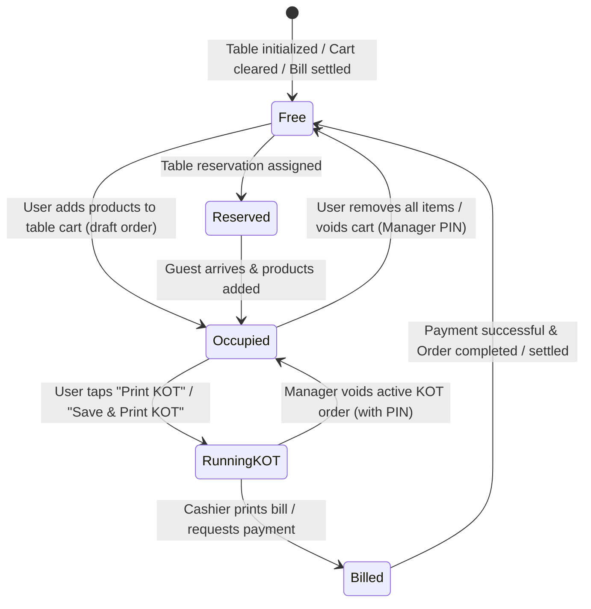
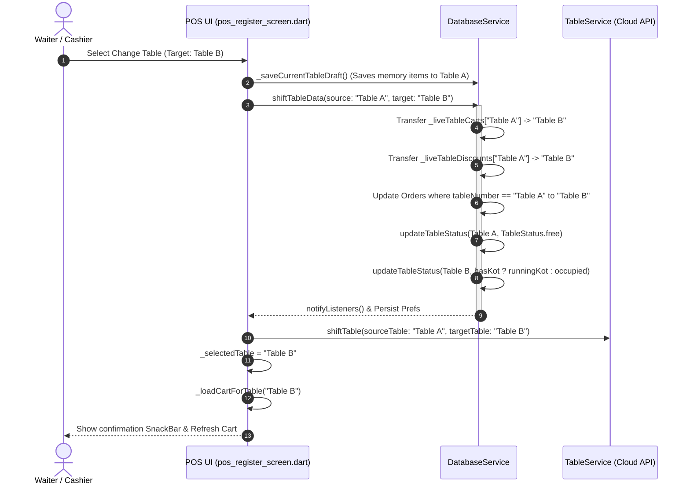

# Technical Requirements Document (TRD)

**Project Name:** Apna POS (Point of Sale & Restaurant Management System)  
**Document Version:** 2.0.0  
**Target Platforms:** Android & Windows Desktop  
**Primary Language / Framework:** Dart / Flutter (SDK ^3.6.0)  
**State Management & Persistence:** ChangeNotifier, SharedPreferences, Local In-Memory Cache, REST / Firestore Synchronization  
**Date:** September 2026  
**Status:** Approved / Implemented  

---

## 1. System Architecture & Component Diagram

```
+-------------------------------------------------------------------------------------------------+
|                                    PRESENTATION LAYER (FLUTTER)                                 |
|                                                                                                 |
|   +-----------------------------------------------------------------------------------------+   |
|   |                              MainLayout (main_layout.dart)                              |   |
|   |   - Top Glass Header Bar (Profile Badge, Online Status, Notification Center)            |   |
|   |   - Responsive Navigation Panel (Desktop Inline Panel / Mobile Slide-In Overlay)       |   |
|   +-----------------------------------------------------------------------------------------+   |
|            |                                |                                   |               |
|            v                                v                                   v               |
|   +-------------------+          +----------------------+             +---------------------+   |
|   | PosRegisterScreen |          | TableManagementScreen|             |     OrdersScreen    |   |
|   | - Menu Grid       |          | - Floor Grids        |             | - Live Status Tabs  |   |
|   | - Live Cart Sheet |          | - Table Cards        |             | - Actions & History |   |
|   | - Change Table    |          | - Take Order Hook    |             | - Scaled Typography |   |
|   +-------------------+          +----------------------+             +---------------------+   |
+-------------------------------------------------------------------------------------------------+
                                                |
                                                v
+-------------------------------------------------------------------------------------------------+
|                                    APPLICATION & SERVICE LAYER                                  |
|                                                                                                 |
|   +-----------------------------+   +----------------------------+   +----------------------+   |
|   |       DatabaseService       |   |        TableService        |   |    PrinterService    |   |
|   | - shiftTableData()          |   | - shiftTable() (Cloud API) |   | - Single KOT Route   |   |
|   | - updateTableStatus()       |   | - updateTableStatus()      |   | - Non-blocking Print |   |
|   | - setLiveTableCart()        |   |                            |   | - Bluetooth/Thermal  |   |
|   +-----------------------------+   +----------------------------+   +----------------------+   |
+-------------------------------------------------------------------------------------------------+
                                                |
                                                v
+-------------------------------------------------------------------------------------------------+
|                                    DATA & HARDWARE LAYER                                        |
|                                                                                                 |
|   +-------------------------+    +--------------------------+    +--------------------------+   |
|   | SharedPreferences Local |    |  Cloud REST / Firestore  |    |  Thermal Printer Device  |   |
|   |  - live_table_carts     |    |   - Table Sync API       |    |   - Single KOT Printer   |   |
|   |  - live_table_discounts |    |   - Multi-Device Push    |    |   - ESC/POS Byte Stream  |   |
|   +-------------------------+    +--------------------------+    +--------------------------+   |
+-------------------------------------------------------------------------------------------------+
```

---

## 2. Core Data Models & State Enums

### 2.1 Table & Order Enums
```dart
enum TableStatus {
  free,         // #10B981 (Emerald Green) - Table is empty, no active orders or live cart items
  occupied,     // #051C48 (Deep Navy / Blue) - User has added products to table cart (draft order)
  runningKot,   // #EF4444 (Vivid Red)     - Active KOT order fired & running in kitchen
  billed,       // #06B6D4 (Cyan)          - Bill requested / generated
  reserved,     // #8B5CF6 (Purple)        - Reserved table
}

enum OrderStatus {
  pending,      // Order generated, KOT active in kitchen
  preparing,    // Kitchen in progress
  completed,    // Billed, paid, and settled
  cancelled,    // Order voided / refunded
}
```

### 2.2 Cart Item Differential Model
```dart
class CartItemModel {
  final MenuItemModel item;
  int quantity;         // Total requested quantity in cart
  String note;
  int kotQuantity;      // Number of units already sent and printed via KOT

  CartItemModel({
    required this.item,
    this.quantity = 1,
    this.note = '',
    this.kotQuantity = 0,
  });

  /// Calculates incremental quantity to be printed in next KOT dispatch
  int get incrementalKotQty => math.max(0, quantity - kotQuantity);

  CartItemModel clone() => CartItemModel(
    item: item,
    quantity: quantity,
    note: note,
    kotQuantity: kotQuantity,
  );
}
```

---

## 3. Incremental KOT Printing & Single-Printer Protocol

### 3.1 Mathematical Formulation of Differential KOT
For any order $\mathcal{O}$ consisting of cart items $I = \{i_1, i_2, \dots, i_n\}$:
$$\Delta Q(i_k) = \max(0, Q_{\text{total}}(i_k) - Q_{\text{printed}}(i_k))$$

* If $\sum_{k=1}^{n} \Delta Q(i_k) = 0$, no physical print command is dispatched; the system displays the existing KOT in view/reprint mode.
* When $\sum_{k=1}^{n} \Delta Q(i_k) > 0$, the thermal printer buffer receives only items with $\Delta Q(i_k) > 0$.
* Post-dispatch, state is atomically updated:
$$Q_{\text{printed}}(i_k) \leftarrow Q_{\text{total}}(i_k), \quad \forall i_k \in I$$

```
Initial Cart: [Biryani: 2, Coke: 1] ──> Print KOT #1: [Biryani x2, Coke x1] ──> (kotQuantity: Biryani=2, Coke=1)
Add 1 Coke, 1 Naan:                 ──> Print KOT #2: [Coke x1, Naan x1]    ──> (kotQuantity: Biryani=2, Coke=2, Naan=1)
```

### 3.2 Non-Blocking Asynchronous Printing Strategy
In `lib/features/pos/kot_dialog.dart`, hard blocking validation (`isPrinterConnected == true`) was removed from the status progression pathway:
```dart
// State transitions immediately to runningKot without waiting for printer socket ACK
final tbl = db.tables.where((t) => isSameTable(t.name, targetTable)).firstOrNull;
if (tbl != null) {
  db.updateTableStatus(tbl.id, TableStatus.runningKot, orderId: order.id);
}
// Printing executes concurrently in background; failures log a SnackBar warning without crashing order state
_printEscPosPayload(order).catchError((e) {
  debugPrint('[KOT Print Error] Silent fallback: $e');
});
```

---

## 4. Real-Time Multi-Device Table Status Synchronization

### 4.1 Centralized Backend State Machine
To guarantee that table status remains synchronized across all connected devices (Android tablets, Windows POS counters, Waiter smartphones) in real time without requiring manual refreshes, the backend (`Node.js/Express + Socket.IO + MongoDB`) acts as the single central source of truth.



### 4.2 WebSocket Event Protocol & Payload Schema
When any device performs a status mutation (e.g. adding products, dispatching KOT, clearing cart, settling payment), the action is sent to the backend, stored in MongoDB, and broadcasted to all connected clients in the tenant room via WebSocket.

**Socket Event Name:** `table:updated`

**Payload Schema:**
```json
{
  "tableId": "tbl_ground_01",
  "name": "T-01",
  "status": "occupied",
  "activeOrderTotal": 450.00,
  "activeItemCount": 3,
  "runningKotCount": 0,
  "occupiedSince": "2026-09-12T01:15:00.000Z",
  "updatedBy": "Counter 1 (Windows)",
  "timestamp": 1726099500000
}
```

**Client Processing (`SocketService` & `DatabaseService`):**
1. Incoming `table:updated` payload triggers `DatabaseService.handleRemoteTableUpdate(payload)`.
2. Local table entry is updated in-memory via `TableModel.copyWith()`.
3. If `status == TableStatus.free`, active order ID and totals are cleared.
4. `notifyListeners()` informs all active UI screens (`TableManagementScreen`, `PosRegisterScreen`, `MainLayout`).
5. Zero screen reload or manual refresh is required.

---

## 5. Dynamic Table Data Shift & Auto-Free Engine

### 5.1 State Transfer Algorithm
When moving from `sourceTable` ($T_{\text{src}}$) to `targetTable` ($T_{\text{dst}}$):



### 5.2 Implementation Reference (`DatabaseService.shiftTableData`)
```dart
void shiftTableData(String sourceTable, String targetTable) {
  if (sourceTable.trim().toLowerCase() == targetTable.trim().toLowerCase()) return;

  // 1. Shift live cart items & totals
  final srcCart = getLiveTableCart(sourceTable);
  final srcTotal = getLiveCartTotal(sourceTable);
  final dstCart = getLiveTableCart(targetTable);

  if (srcCart.isNotEmpty) {
    if (dstCart.isEmpty) {
      setLiveTableCart(targetTable, srcCart);
      setLiveCartTotal(targetTable, srcTotal);
    } else {
      // Merge items into destination
      final mergedCart = List<CartItemModel>.from(dstCart);
      for (final srcItem in srcCart) {
        final existingIdx = mergedCart.indexWhere(
          (m) => m.item.id == srcItem.item.id && m.note == srcItem.note,
        );
        if (existingIdx != -1) {
          mergedCart[existingIdx] = CartItemModel(
            item: mergedCart[existingIdx].item,
            quantity: mergedCart[existingIdx].quantity + srcItem.quantity,
            note: mergedCart[existingIdx].note,
            kotQuantity: mergedCart[existingIdx].kotQuantity + srcItem.kotQuantity,
          );
        } else {
          mergedCart.add(srcItem.clone());
        }
      }
      setLiveTableCart(targetTable, mergedCart);
      setLiveCartTotal(targetTable, (_liveCartTotals[targetTable] ?? 0.0) + srcTotal);
    }
  }

  // 2. Shift discount metadata
  final srcDiscount = getLiveTableDiscount(sourceTable);
  if (srcDiscount != null) {
    setLiveTableDiscount(
      targetTable,
      coupon: srcDiscount['coupon']?.toString() ?? '',
      discountInput: (srcDiscount['discountInput'] as num?)?.toDouble() ?? 0.0,
      discountMode: srcDiscount['discountMode']?.toString() ?? 'percent',
      discountAmount: (srcDiscount['discountAmount'] as num?)?.toDouble() ?? 0.0,
    );
  }
  _liveTableCarts.remove(sourceTable);
  _liveCartTotals.remove(sourceTable);
  _liveTableDiscounts.remove(sourceTable);

  // 3. Shift Active Orders
  for (int i = 0; i < orders.length; i++) {
    final o = orders[i];
    if (isSameTable(o.tableNumber, sourceTable) &&
        (o.status == OrderStatus.pending || o.status == OrderStatus.preparing)) {
      orders[i] = o.copyWith(tableNumber: targetTable);
    }
  }

  // 4. Update Status: Free Source Table & Activate Target Table
  final srcTbl = tables.where((t) => isSameTable(t.name, sourceTable)).firstOrNull;
  final dstTbl = tables.where((t) => isSameTable(t.name, targetTable)).firstOrNull;

  if (srcTbl != null) updateTableStatus(srcTbl.id, TableStatus.free);
  if (dstTbl != null) {
    final hasKotOrders = orders.any((o) =>
      isSameTable(o.tableNumber, targetTable) &&
      (o.status == OrderStatus.pending || o.status == OrderStatus.preparing),
    );
    final finalCart = getLiveTableCart(targetTable);
    final newStatus = hasKotOrders
        ? TableStatus.runningKot
        : (finalCart.isNotEmpty ? TableStatus.occupied : TableStatus.free);
    updateTableStatus(dstTbl.id, newStatus);
  }

  _saveLiveTableCartsToPrefs();
  _saveOrdersToPrefs();
  _saveTablesToPrefs();
  notifyListeners();
}
```

---

## 6. Payment Method Screen Architecture & Responsive Backdrop Blur

### 6.1 Modal Backdrop Filter & Glassmorphism Blur
When opening the checkout/payment overlay, the entire background is blurred using hardware-accelerated `BackdropFilter` with `ImageFilter.blur(sigmaX: 6, sigmaY: 6)` and dark scrim `Color(0x73000000)`.

```dart
showGeneralDialog(
  context: context,
  barrierDismissible: true,
  barrierLabel: 'PaymentModal',
  barrierColor: Colors.black.withOpacity(0.45),
  transitionDuration: const Duration(milliseconds: 280),
  pageBuilder: (ctx, anim1, anim2) {
    return BackdropFilter(
      filter: ImageFilter.blur(sigmaX: 6, sigmaY: 6),
      child: Dialog(
        backgroundColor: Colors.transparent,
        insetPadding: const EdgeInsets.symmetric(horizontal: 16, vertical: 24),
        child: ConstrainedBox(
          constraints: const BoxConstraints(maxWidth: 520, maxHeight: 680),
          child: PaymentModalContent(...),
        ),
      ),
    );
  },
);
```

### 6.2 Responsive Wrapped Layout
The payment modal supports seamless adaptation between mobile Android screens and desktop Windows monitors:
- **Wrap Grid for Payment Modes**: Mode selector chips wrap gracefully across rows when screen width is constrained (`Wrap(spacing: 8, runSpacing: 8)`).
- **Responsive Sizing**:
  - Windows / Desktop / Web: Fixed `maxWidth: 520px`, centered modal with rounded corners (`BorderRadius.circular(24)`).
  - Android / Mobile: Max width matches viewport with `16px` padding and max height constrained to `85%` of screen height.

---

## 7. POS Product Catalog View Modes

### 7.1 View Mode Architecture
Cashiers can toggle between two distinct product browsing modes:
1. **Grid View (With Images)**: Large visual cards with dish photos, price badges, and category labels.
2. **Compact View (Without Images)**: Streamlined, text-only compact boxes designed for ultra-fast high-volume billing.

### 7.2 Compact & Wrapped Without-Images Specification
- **Android / Mobile Wrapped Flow**: On Android / mobile form factors, product boxes are rendered inside `SingleChildScrollView` + `Wrap(spacing: 8, runSpacing: 8)`. Box widths adapt dynamically (2 columns on mobile phones, 3 columns on `≥ 460px`, and 4 columns on `≥ 680px`), allowing cards to wrap naturally across screen width.
- **Card Height**: Constrained to `64px` on mobile and `72px` on desktop.
- **Content Alignment**: Vertical and horizontal center (`MainAxisAlignment.center`, `CrossAxisAlignment.center`).
- **Product Title**: Single/double-line truncated text (`12px` bold `#0F172A`).
- **Price Tag**: Prominently displayed below title (`12px` w900 `#051C48` or strikethrough original price).
- **Corner Badges**: Food type dot (Veg/Non-Veg) top-left, cart quantity / variant count / discount top-right.
- **Haptic Feedback**: Scale tap animation and instant cart addition on click.

---

## 8. File Modifications & Code Delta Matrix

| File Path | Primary Modification | Impact Area |
| :--- | :--- | :--- |
| `lib/core/models/table_model.dart` | 1. Updated `copyWith()` so `TableStatus.free` clears `currentOrderId`, `activeOrderTotal`, and `activeItemCount`.<br>2. String parser deserializes `runningKot`, `running_kot`, `occupied`, `free`, and `billed`. | Data Models & Serialization |
| `lib/core/database/database_service.dart` | 1. `_reconcileTablesWithRunningOrders()` enforces `free` for empty tables, `occupied` for draft carts, and `runningKot` for active KOTs.<br>2. `shiftTableData()` preserves multi-device consistency. | Business Logic & Local DB |
| `lib/features/pos/pos_register_screen.dart` | 1. POS View Mode toggle (With Images vs Without Images compact centered height `72px`).<br>2. Payment Modal with frosted backdrop blur and responsive wrap layout.<br>3. `_syncTableStatusWithCart()` auto-transitions table to `occupied` on add and `free` on clear. | POS Cashier Screen |
| `lib/features/tables/table_management_screen.dart` | 1. Real-time table status color coding (`#10B981` Free, `#051C48` Occupied, `#EF4444` Running KOT, `#06B6D4` Billed).<br>2. Socket-driven automatic UI repaint without page refresh. | Floor Management |
| `backend/src/services/tableService.js` | Backend table enrichment logic ensuring tables without active orders or cart items strictly resolve to `free`. | Backend REST & WebSockets |
| `backend/src/services/orderService.js` | Centralized table status transitions on KOT creation (`runningKot`) and settlement (`free`). | Order Service Backend |

---

## 9. Verification & Static Analysis

* **Flutter Unit Tests:** `flutter test test/realtime_table_test.dart` (100% Passed across 4 lifecycle suites).
* **Backend Integration Tests:** `npx jest tests/realtime_table.test.js` (100% Passed across 3 multi-device Socket.IO connections).
* **Static Analysis:** `flutter analyze lib/core/models/table_model.dart lib/core/database/database_service.dart lib/features/pos/pos_register_screen.dart` (0 Errors).
* **Cross-Platform Compatibility:** Validated for Android ARM64/x86_64 and Windows x64.

