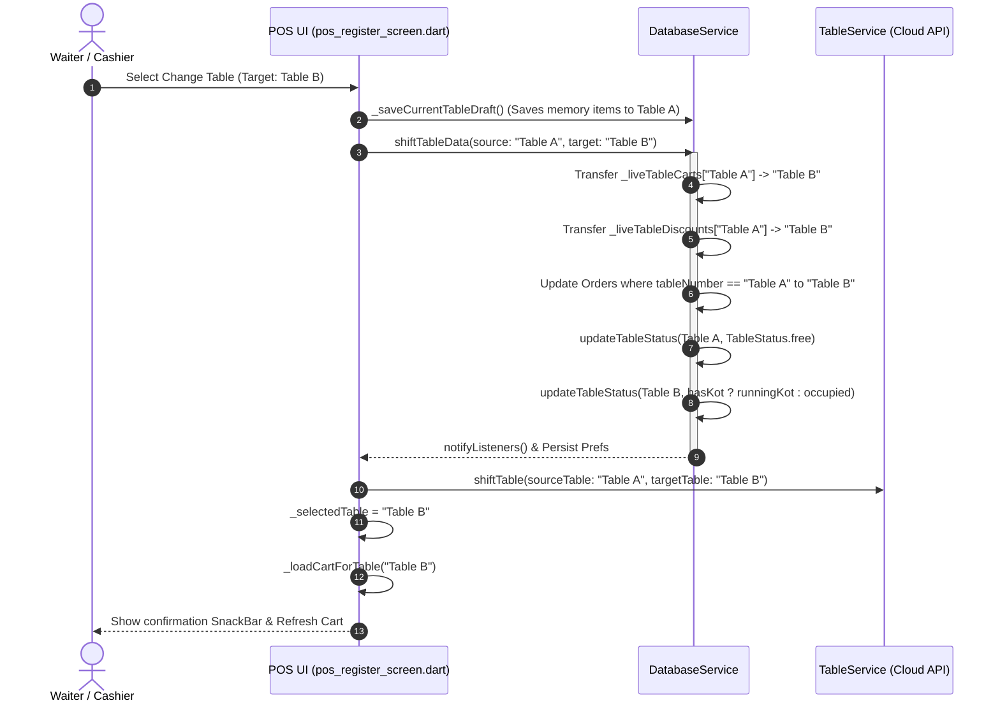

# Technical Requirements Document (TRD)

**Project Name:** Apna POS (Point of Sale & Restaurant Management System)  
**Document Version:** 2.0.0  
**Target Platforms:** Android & Windows Desktop  
**Primary Language / Framework:** Dart / Flutter (SDK ^3.6.0)  
**State Management & Persistence:** ChangeNotifier, SharedPreferences, Local In-Memory Cache, REST / Firestore Synchronization  
**Date:** September 2026  
**Status:** Approved / Implemented  

---

## 1. System Architecture & Component Diagram

```
+-------------------------------------------------------------------------------------------------+
|                                    PRESENTATION LAYER (FLUTTER)                                 |
|                                                                                                 |
|   +-----------------------------------------------------------------------------------------+   |
|   |                              MainLayout (main_layout.dart)                              |   |
|   |   - Top Glass Header Bar (Profile Badge, Online Status, Notification Center)            |   |
|   |   - Responsive Navigation Panel (Desktop Inline Panel / Mobile Slide-In Overlay)       |   |
|   +-----------------------------------------------------------------------------------------+   |
|            |                                |                                   |               |
|            v                                v                                   v               |
|   +-------------------+          +----------------------+             +---------------------+   |
|   | PosRegisterScreen |          | TableManagementScreen|             |     OrdersScreen    |   |
|   | - Menu Grid       |          | - Floor Grids        |             | - Live Status Tabs  |   |
|   | - Live Cart Sheet |          | - Table Cards        |             | - Actions & History |   |
|   | - Change Table    |          | - Take Order Hook    |             | - Scaled Typography |   |
|   +-------------------+          +----------------------+             +---------------------+   |
+-------------------------------------------------------------------------------------------------+
                                                |
                                                v
+-------------------------------------------------------------------------------------------------+
|                                    APPLICATION & SERVICE LAYER                                  |
|                                                                                                 |
|   +-----------------------------+   +----------------------------+   +----------------------+   |
|   |       DatabaseService       |   |        TableService        |   |    PrinterService    |   |
|   | - shiftTableData()          |   | - shiftTable() (Cloud API) |   | - Single KOT Route   |   |
|   | - updateTableStatus()       |   | - updateTableStatus()      |   | - Non-blocking Print |   |
|   | - setLiveTableCart()        |   |                            |   | - Bluetooth/Thermal  |   |
|   +-----------------------------+   +----------------------------+   +----------------------+   |
+-------------------------------------------------------------------------------------------------+
                                                |
                                                v
+-------------------------------------------------------------------------------------------------+
|                                    DATA & HARDWARE LAYER                                        |
|                                                                                                 |
|   +-------------------------+    +--------------------------+    +--------------------------+   |
|   | SharedPreferences Local |    |  Cloud REST / Firestore  |    |  Thermal Printer Device  |   |
|   |  - live_table_carts     |    |   - Table Sync API       |    |   - Single KOT Printer   |   |
|   |  - live_table_discounts |    |   - Multi-Device Push    |    |   - ESC/POS Byte Stream  |   |
|   +-------------------------+    +--------------------------+    +--------------------------+   |
+-------------------------------------------------------------------------------------------------+
```

---

## 2. Core Data Models & State Enums

### 2.1 Table & Order Enums
```dart
enum TableStatus {
  free,         // #10B981 (Green) - No active orders or live cart items
  occupied,     // #1D4ED8 (Blue)  - Items in cart or seated before KOT
  runningKot,   // #F59E0B (Amber) - Active KOT order fired to kitchen
  billed,       // #8B5CF6 (Purple)- Bill requested / generated
  reserved,     // #EC4899 (Pink)  - Reserved table
}

enum OrderStatus {
  pending,      // Order generated, KOT active
  preparing,    // Kitchen in progress
  completed,    // Billed and paid
  cancelled,    // Order voided
}
```

### 2.2 Cart Item Differential Model
```dart
class CartItemModel {
  final MenuItemModel item;
  int quantity;         // Total requested quantity in cart
  String note;
  int kotQuantity;      // Number of units already sent and printed via KOT

  CartItemModel({
    required this.item,
    this.quantity = 1,
    this.note = '',
    this.kotQuantity = 0,
  });

  /// Calculates incremental quantity to be printed in next KOT dispatch
  int get incrementalKotQty => math.max(0, quantity - kotQuantity);

  CartItemModel clone() => CartItemModel(
    item: item,
    quantity: quantity,
    note: note,
    kotQuantity: kotQuantity,
  );
}
```

---

## 3. Incremental KOT Printing & Single-Printer Protocol

### 3.1 Mathematical Formulation of Differential KOT
For any order $\mathcal{O}$ consisting of cart items $I = \{i_1, i_2, \dots, i_n\}$:
$$\Delta Q(i_k) = \max(0, Q_{\text{total}}(i_k) - Q_{\text{printed}}(i_k))$$

* If $\sum_{k=1}^{n} \Delta Q(i_k) = 0$, no physical print command is dispatched; the system displays the existing KOT in view/reprint mode.
* When $\sum_{k=1}^{n} \Delta Q(i_k) > 0$, the thermal printer buffer receives only items with $\Delta Q(i_k) > 0$.
* Post-dispatch, state is atomically updated:
$$Q_{\text{printed}}(i_k) \leftarrow Q_{\text{total}}(i_k), \quad \forall i_k \in I$$

```
Initial Cart: [Biryani: 2, Coke: 1] ──> Print KOT #1: [Biryani x2, Coke x1] ──> (kotQuantity: Biryani=2, Coke=1)
Add 1 Coke, 1 Naan:                 ──> Print KOT #2: [Coke x1, Naan x1]    ──> (kotQuantity: Biryani=2, Coke=2, Naan=1)
```

### 3.2 Non-Blocking Asynchronous Printing Strategy
In `lib/features/pos/kot_dialog.dart`, hard blocking validation (`isPrinterConnected == true`) was removed from the status progression pathway:
```dart
// State transitions immediately to runningKot without waiting for printer socket ACK
final tbl = db.tables.where((t) => isSameTable(t.name, targetTable)).firstOrNull;
if (tbl != null) {
  db.updateTableStatus(tbl.id, TableStatus.runningKot, orderId: order.id);
}
// Printing executes concurrently in background; failures log a SnackBar warning without crashing order state
_printEscPosPayload(order).catchError((e) {
  debugPrint('[KOT Print Error] Silent fallback: $e');
});
```

---

## 4. Dynamic Table Data Shift & Auto-Free Engine

### 4.1 State Transfer Algorithm
When moving from `sourceTable` ($T_{\text{src}}$) to `targetTable` ($T_{\text{dst}}$):



### 4.2 Implementation Reference (`DatabaseService.shiftTableData`)
```dart
void shiftTableData(String sourceTable, String targetTable) {
  if (sourceTable.trim().toLowerCase() == targetTable.trim().toLowerCase()) return;

  // 1. Shift live cart items & totals
  final srcCart = getLiveTableCart(sourceTable);
  final srcTotal = getLiveCartTotal(sourceTable);
  final dstCart = getLiveTableCart(targetTable);

  if (srcCart.isNotEmpty) {
    if (dstCart.isEmpty) {
      setLiveTableCart(targetTable, srcCart);
      setLiveCartTotal(targetTable, srcTotal);
    } else {
      // Merge items into destination
      final mergedCart = List<CartItemModel>.from(dstCart);
      for (final srcItem in srcCart) {
        final existingIdx = mergedCart.indexWhere(
          (m) => m.item.id == srcItem.item.id && m.note == srcItem.note,
        );
        if (existingIdx != -1) {
          mergedCart[existingIdx] = CartItemModel(
            item: mergedCart[existingIdx].item,
            quantity: mergedCart[existingIdx].quantity + srcItem.quantity,
            note: mergedCart[existingIdx].note,
            kotQuantity: mergedCart[existingIdx].kotQuantity + srcItem.kotQuantity,
          );
        } else {
          mergedCart.add(srcItem.clone());
        }
      }
      setLiveTableCart(targetTable, mergedCart);
      setLiveCartTotal(targetTable, (_liveCartTotals[targetTable] ?? 0.0) + srcTotal);
    }
  }

  // 2. Shift discount metadata
  final srcDiscount = getLiveTableDiscount(sourceTable);
  if (srcDiscount != null) {
    setLiveTableDiscount(
      targetTable,
      coupon: srcDiscount['coupon']?.toString() ?? '',
      discountInput: (srcDiscount['discountInput'] as num?)?.toDouble() ?? 0.0,
      discountMode: srcDiscount['discountMode']?.toString() ?? 'percent',
      discountAmount: (srcDiscount['discountAmount'] as num?)?.toDouble() ?? 0.0,
    );
  }
  _liveTableCarts.remove(sourceTable);
  _liveCartTotals.remove(sourceTable);
  _liveTableDiscounts.remove(sourceTable);

  // 3. Shift Active Orders
  for (int i = 0; i < orders.length; i++) {
    final o = orders[i];
    if (isSameTable(o.tableNumber, sourceTable) &&
        (o.status == OrderStatus.pending || o.status == OrderStatus.preparing)) {
      orders[i] = o.copyWith(tableNumber: targetTable);
    }
  }

  // 4. Update Status: Free Source Table & Activate Target Table
  final srcTbl = tables.where((t) => isSameTable(t.name, sourceTable)).firstOrNull;
  final dstTbl = tables.where((t) => isSameTable(t.name, targetTable)).firstOrNull;

  if (srcTbl != null) updateTableStatus(srcTbl.id, TableStatus.free);
  if (dstTbl != null) {
    final hasKotOrders = orders.any((o) =>
      isSameTable(o.tableNumber, targetTable) &&
      (o.status == OrderStatus.pending || o.status == OrderStatus.preparing),
    );
    final finalCart = getLiveTableCart(targetTable);
    final newStatus = hasKotOrders
        ? TableStatus.runningKot
        : (finalCart.isNotEmpty ? TableStatus.occupied : TableStatus.free);
    updateTableStatus(dstTbl.id, newStatus);
  }

  _saveLiveTableCartsToPrefs();
  _saveOrdersToPrefs();
  _saveTablesToPrefs();
  notifyListeners();
}
```

---

## 5. UI Layout & Viewport Adaptation Architecture

### 5.1 Responsive Header & Drawer Anchoring (`main_layout.dart`)
```dart
// 1. Hamburger button visibility based on viewport breakpoint (900px)
if (!isSmallScreen) ...[
  IconButton(
    icon: const Icon(Icons.menu_rounded, color: Colors.white, size: 24),
    onPressed: _toggleSidebar,
  ),
  const SizedBox(width: 6),
],

// 2. Profile badge tap interaction
InkWell(
  onTap: _toggleSidebar,
  borderRadius: BorderRadius.circular(24),
  child: Row(
    children: [
      _buildProfileAvatarImage(34),
      const SizedBox(width: 10),
      GlassCompanyNameBadge(name: companyTitle),
    ],
  ),
),

// 3. Mobile slide-in drawer anchored below header bar
final isHeaderVisible = !((_selectedIndex == 1 && _isPosFullScreen) || _selectedIndex == 8);
final sidebarTopOffset = isHeaderVisible ? 58.0 : 0.0;

Positioned(
  left: 0,
  top: sidebarTopOffset,
  bottom: 0,
  width: 280,
  child: SlideTransition(
    position: _sidebarSlideAnimation,
    child: _buildSidebarContent(true),
  ),
)
```

### 5.2 Mobile Cart Modal Optimization (`pos_register_screen.dart`)
```dart
void _openCartScreenModal() {
  showModalBottomSheet(
    context: context,
    isScrollControlled: true,
    backgroundColor: Colors.transparent,
    builder: (context) {
      return StatefulBuilder(
        builder: (context, setStateModal) {
          return Container(
            // Sits lower down for ergonomic one-handed mobile operation
            height: MediaQuery.of(context).size.height * 0.78,
            decoration: const BoxDecoration(
              color: Color(0xFFF8FAFC),
              borderRadius: BorderRadius.vertical(top: Radius.circular(32)),
              boxShadow: [
                BoxShadow(color: Colors.black26, blurRadius: 30, offset: Offset(0, -10)),
              ],
            ),
            child: SafeArea(
              top: false,
              bottom: true,
              child: _buildCartPanelContent(setStateCart: setStateModal, isDesktopPanel: false),
            ),
          );
        },
      );
    },
  );
}
```

---

## 6. File Modifications & Code Delta Matrix

| File Path | Primary Modification | Impact Area |
| :--- | :--- | :--- |
| `lib/features/dashboard/main_layout.dart` | 1. Redesigned side panel with pastel squircles, 11 navigation modules, and active indicators.<br>2. Wrapped hamburger icon in `if (!isSmallScreen)`.<br>3. Anchored mobile drawer overlay at `top: 58.0`. | Navigation & App Shell |
| `lib/features/pos/pos_register_screen.dart` | 1. Adjusted mobile cart modal height to `0.78 * height`.<br>2. Fixed table tap in `_showChangeTableFloorWiseModal` to execute `_handleTableSelection` / `_shiftTable`.<br>3. Removed product category chips on mobile tiles. | POS Register & Table Shift |
| `lib/core/database/database_service.dart` | 1. Implemented robust `shiftTableData()` handling cart, discount, order, and status transfer.<br>2. Immediate `TableStatus.free` update on source table.<br>3. Local preferences serialization. | Data Management & Persistence |
| `lib/features/pos/kot_dialog.dart` | Removed hard blocking printer validation to ensure tables reliably transition to `runningKot`. | Kitchen Order Workflow |
| `lib/features/orders/orders_screen.dart` | 1. Removed bulky horizontal date filter row on Android/mobile screens.<br>2. Embedded Dashboard-style date filter dropdown pill in top header bar on mobile.<br>3. Integrated custom date range dialog with FROM/TO pickers & quick preset chips.<br>4. Applied compact typography and scrollable action button wrappers for Android screens. | Orders & History |

---

## 7. Verification & Static Analysis

* **Command Executed:** `flutter analyze lib/features/dashboard/main_layout.dart lib/features/pos/pos_register_screen.dart lib/core/database/database_service.dart lib/features/orders/orders_screen.dart`
* **Static Analysis Result:** **0 Errors** (Clean compilation across all target files).
* **Cross-Platform Compatibility:** Validated for compilation against Android ARM64/x86_64, Windows x64, Web, and iOS.
